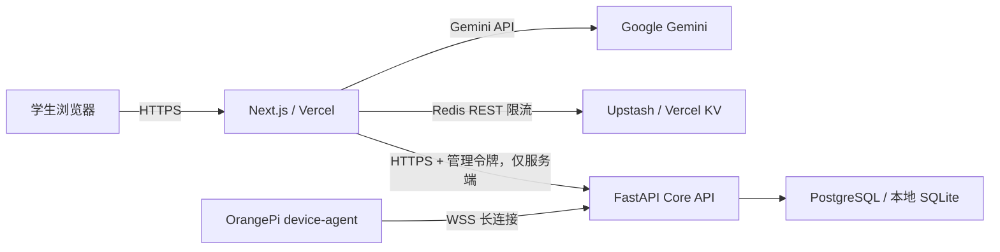

# Mambo K12 AI Robot

Mambo 是面向 K12 人工智能通识教育的多模态学习原型。学生可以按学段学习原创课程，通过对话、图片、语音、动画、绘本、编程和游戏化练习完成一个可重复演示的学习闭环；OrangePi 作为可选的桌面机器人终端，通过独立 Core API 保持长连接。

> 当前状态：比赛 P0 原型，不是可直接面向真实学校上线的生产系统。网页学习数据仍保存在当前浏览器，尚未完成登录、教材 RAG、教师 CMS、共享学习会话和生产数据库贯通。实际实现边界见 [P0 保真清单](docs/evidence/p0-fidelity-ledger.md)。

## 已实现

- 四个学段：小学低年级、小学高年级、初中、高中；每个学段 2 门原创种子课，共 8 门。
- Gemini 流式对话、单张 JPEG/PNG/WebP 图片提问、浏览器录音转写、浏览器中文朗读；每门课程有界保存完整文字轮次并可刷新恢复；空流或上游中断时返回带来源的课程内降级回答。
- 冒泡排序和神经网络/图像分类锚点课程使用版本化参考目录，展示经核对事实和 NIST/PyTorch/scikit-learn 来源，并把 `[S#]` 引用上下文加入提示词。
- DOCX 讲义与 PPTX 课件真实生成、下载；锚点课编入来源标签/URL，其他课明确标注为未绑定正式教材的项目种子内容。
- 冒泡排序与神经网络两套确定性交互动画，支持播放、暂停、单步、重置和调速。
- 4-8 页结构化互动绘本，包含项目内插图、旁白、页内问题、本机保存与回看；AI 不可用时回退原创种子内容。
- Monaco + Pyodide Python 实验室，提供冒泡排序和图像特征分类两个确定性挑战。
- 单选、排序、代码追踪三类确定性练习，即时反馈、知识点掌握度、间隔复习与可解释推荐。
- OrangePi WebSocket 自动重连、心跳、状态上报、空闲离线、消息边界/连接内去重、`ping`/`get_status` 白名单命令，以及网页只读设备状态；代理按 `/dev` 节点声明摄像头、音频、屏幕和 NPU 能力。
- FastAPI、SQLAlchemy、Alembic、SQLite/PostgreSQL、Dockerfile、systemd 和 OpenAPI 基础。

## 架构边界



- `apps/web` 是学生使用的 Next.js 网页，可部署到 Vercel。
- `server` 是支持常驻进程和 WebSocket 的 Core API，必须部署到容器、云主机或其他支持长连接的平台，不能由 Vercel 网页替代。
- `device` 是 OrangePi 代理。它主动连接 Core API，不接受远程 Shell。
- 当前网页只通过 `/api/device` 读取经清洗的设备状态。网页的答题、掌握度与绘本仍使用 `localStorage`，尚未写入 Core API 数据库。

## 仓库结构

```text
apps/web/                   Next.js 学习工作台与 Server Route Handlers
device/                     OrangePi device-agent
server/app/                 FastAPI Core API 与设备网关
server/migrations/          Alembic 数据库迁移
compose.yaml                Core API + PostgreSQL 单副本容器栈
deploy/                     OrangePi systemd 配置
.github/workflows/ci.yml    Web 与 Python 自动化验证
docs/deployment/            本地与公网部署说明
docs/evidence/              需求、评分项与实现保真证据
docs/report/                项目报告与演示脚本
docs/verification/          发布验收命令与证据记录规则
```

## 本地启动

要求：Node.js 20+、npm、Python 3.10+。Windows 与 Linux 可以分别启动 Core API 和网页；它们也可以运行在两台机器上。

### 1. Core API

Windows PowerShell：

```powershell
python -m venv .venv
.\.venv\Scripts\Activate.ps1
python -m pip install -r server/requirements-dev.txt
Copy-Item .env.example .env
# 编辑 .env，为 DEVICE_AUTH_TOKEN 与 ADMIN_API_TOKEN 生成不同的随机值
$python = (Resolve-Path .\.venv\Scripts\python.exe).Path
& $python -m dotenv -f .env run -- $python -m alembic upgrade head
& $python -m dotenv -f .env run -- $python -m uvicorn server.app.main:app --host 0.0.0.0 --port 8000
```

Linux：

```bash
python3 -m venv .venv
source .venv/bin/activate
python -m pip install -r server/requirements-dev.txt
cp .env.example .env
# 编辑 .env，为 DEVICE_AUTH_TOKEN 与 ADMIN_API_TOKEN 生成不同的随机值
.venv/bin/python -m dotenv -f .env run -- .venv/bin/python -m alembic upgrade head
.venv/bin/python -m dotenv -f .env run -- .venv/bin/python -m uvicorn server.app.main:app --host 0.0.0.0 --port 8000
```

以上命令让 Alembic 与 Uvicorn 从同一个 `.env` 读取 `DATABASE_URL`，先迁移再监听 `0.0.0.0:8000`。也可以在仓库根目录运行 `scripts/start-server.ps1`（Windows）或 `scripts/start-server.sh`（Linux）；两个脚本会用同一个 `.env` 依次启动迁移和服务。

- 健康检查：`http://127.0.0.1:8000/api/v1/health`
- OpenAPI：`http://127.0.0.1:8000/docs`

### 2. 学习网页

Windows PowerShell：

```powershell
npm install
Copy-Item apps/web/.env.example apps/web/.env.local
# 编辑 apps/web/.env.local；密钥只放在本机环境文件
npm run dev
```

Linux：

```bash
npm install
cp apps/web/.env.example apps/web/.env.local
# 编辑 apps/web/.env.local；密钥只放在本机环境文件
npm run dev
```

打开 `http://localhost:3000`。只看固定课程、动画、种子绘本、材料、练习和编程实验时可不配置 Gemini；对话和录音转写需要 `GOOGLE_GENERATIVE_AI_API_KEY`。

### 3. OrangePi 代理

```bash
python3 -m venv .venv
source .venv/bin/activate
python -m pip install -r device/requirements.txt

export DEVICE_ID="orangepi4pro-dev-01"
export DEVICE_AUTH_TOKEN="与 Core API 中该环境的设备令牌一致"
export SERVER_WS_URL="ws://<Core API 局域网地址>:8000/ws/v1/devices"
python -m device.agent
```

正式公网环境必须把 `SERVER_WS_URL` 改为 `wss://.../ws/v1/devices`。systemd 示例见 `deploy/mambo-device-agent.service`；安装 systemd 单元和写入 `/etc` 需要用户明确执行 `sudo`。

## 数据与演示边界

| 数据 | 当前保存位置 | 刷新后 | 跨浏览器/跨设备 |
|---|---|---:|---:|
| 学段、最近课程、兴趣、答题、掌握度 | 浏览器 `localStorage` | 保留 | 不共享 |
| 保存的绘本版本 | 浏览器 `localStorage` | 保留 | 不共享 |
| 每门课完整文字对话轮次 | 浏览器 `localStorage`，最多 20 条/20,000 字符 | 保留 | 不共享 |
| 对话图片、录音二进制 | 当前页面内存；发送给 Gemini API | 不保留 | 不共享 |
| 设备、状态历史、命令结果 | Core API 数据库 | 保留 | 可共享 |
| Core API 学生/课程/会话基础表 | Core API 数据库 | 保留 | 网页尚未接入 |

因此，本版本适合单浏览器比赛演示。刷新可恢复当前课程的有界文字对话，但图片/录音不会恢复；不应将本机掌握度称为正式成绩，也不能声称网页与机器人已共享同一学习会话。

## 验证命令

```powershell
npm run test --workspace apps/web -- --run
npm run lint --workspace apps/web
npm run typecheck --workspace apps/web
npm run build --workspace apps/web
npm run smoke:lab --workspace apps/web
.\.venv\Scripts\python.exe -m pytest
git diff --check
```

Linux 将最后一条 Python 命令改为 `.venv/bin/python -m pytest`。完整发布清单见 [P0 发布验收](docs/verification/p0-release-checklist.md)。本轮按用户要求未执行浏览器视觉验收，不能用单元测试和构建结果替代真实浏览器、麦克风权限、移动端布局或云端链路验收。

GitHub Actions 在 push/PR 时使用 Node.js 22 执行 Web 测试、lint、typecheck、build 和真实 Pyodide smoke，并使用 Python 3.12 执行 `pytest`。CI 配置存在不等于当前 release 已通过，结论以对应 commit 的 Actions 结果和本地发布日志为准。

## 部署

- [生产部署指南](docs/deployment/production.md)：Vercel、Redis、Core API、PostgreSQL、WSS 和 OrangePi 配置。
- [比赛演示脚本](docs/report/demo-script.md)：在网络或机器人不可用时也能降级完成的 8-10 分钟流程。
- [项目技术报告](docs/report/project-report.md)：架构、模型策略、多模态路线、难题、安全与后续计划。
- [赛题证据矩阵](docs/evidence/index.md)：R01-R16 与代码、测试、手工证据状态。
- [2026-07-18 验证记录](docs/verification/2026-07-18-p0-results.md)：本次真实结果、GitHub CI 证据和 Vercel 阻塞。

## 安全提示

- 不要提交 `.env`、`.env.local`、API Key、Redis Token、Core 管理令牌、设备令牌或 SSH 私钥。
- Vercel 上的 AI 路由在没有 Redis REST 限流存储时会返回 `AI_GUARD_UNAVAILABLE`，这是故障关闭设计。
- 公网 Core API 必须使用 HTTPS/WSS；当前设备鉴权是环境级共享令牌，真实多设备部署前应升级为每设备独立凭证。
- Python 实验是无主站同源权限的浏览器隔离练习，不是正式判题沙箱，结果只作为低权重形成性证据。
- 完整文字对话会有界保存在当前浏览器且不会自动脱敏；演示不要输入真实姓名、学校、住址、联系方式或其他个人信息，清除站点数据可删除本机记录。
- 公开试用前仍需补齐登录授权、未成年人监护/同意、数据删除、内容审核、审计、备份、监控与事件响应。

产品边界禁止医学、心理或自闭症诊断，也禁止大模型直接控制电机、执行 Shell 或运行任意服务端代码。当前聊天提示已经限制真实姓名、住址、联系方式、密钥泄露和角色绕过，但尚未显式覆盖诊断与危险问答，也没有对抗评测；公开试用前必须补齐，不能把产品边界当作已验证防护。
