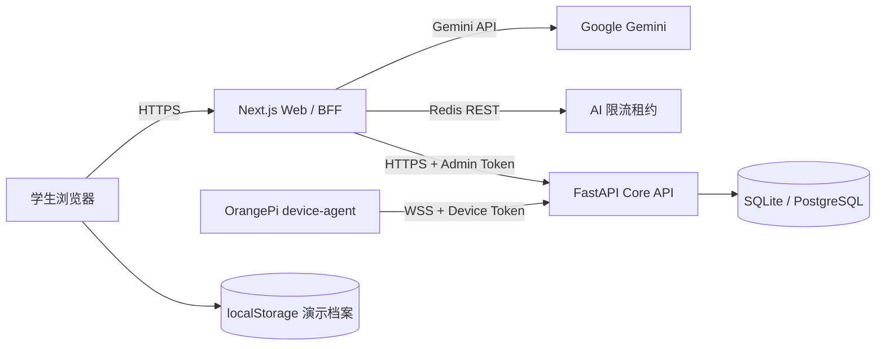

# 系统架构与边界

本文件描述当前 P0 代码，而不是最终生产蓝图。完整产品设计见 [`product-technical-design.md`](product-technical-design.md)，实现差异见 [`evidence/p0-fidelity-ledger.md`](evidence/p0-fidelity-ledger.md)。

## 当前拓扑

- `apps/web` 是学生主要操作界面，包含四学段课程、对话、材料、动画、绘本、Python、练习和进度页。
- Next.js Route Handler 保存 Gemini、Redis 和 Core 管理凭据；浏览器不直接持有这些密钥。
- `server` 是常驻 FastAPI Core API 与设备网关，保存设备、状态、命令和现有学习领域表。
- `device` 由 OrangePi 主动连接 Core，执行 `ping`、`get_status` 白名单命令并保守声明实际设备节点。
- 当前网页学习记录、文字对话与绘本保存在本机浏览器；Core 学习表尚未与网页贯通，因此不是跨账号或跨设备档案。

## 部署职责

| 单元 | 运行位置 | 当前职责 |
|---|---|---|
| Next.js | Vercel 或 Node.js | 页面、AI BFF、DOCX/PPTX、只读设备状态适配 |
| Redis REST | Upstash 或兼容 Vercel KV | Vercel 多实例 AI 配额与并发租约；缺失时故障关闭 |
| FastAPI Core | 单副本常驻容器/虚拟机 | WebSocket、设备状态、白名单命令、学习基础 API |
| PostgreSQL | Core 同区域托管服务 | Core 持久化；本地开发可使用 SQLite |
| OrangePi | 教学现场 | 音视频与 NPU 硬件承载、状态采集、断线重连 |

Vercel 不能承载 OrangePi 的长期 WebSocket 网关。公网链路必须是浏览器到 Vercel 的 HTTPS、Vercel 到 Core 的 HTTPS，以及 OrangePi 到 Core 的 WSS。

## 安全边界

- 模型只生成文本或受 Schema 约束的数据；动画、练习、文档和绘本由确定性程序渲染。
- Python 在无主站同源权限的 sandbox iframe 和 Worker 中运行，禁用网络，结果只作为低权重形成性证据。
- 设备不接收 Shell；消息有大小/深度限制、空闲超时、连接内去重和状态历史上限。
- 网页设备接口只返回名称、在线状态、最后心跳和 capability 白名单，不返回管理令牌或完整状态 JSON。
- 目前设备使用环境级共享令牌，Core 连接管理为进程内状态。正式多设备/多副本部署前必须升级为独立凭证和跨实例路由。

## 生产化缺口

1. 登录、学生/教师/管理员角色与资源级授权。
2. 网页学习状态接入 Core PostgreSQL，并提供删除、导出和跨端恢复。
3. 正式教材授权、解析、检索、教师审核和准确性评测；当前只有两个锚点主题的版本化权威来源，不是完整 RAG。
4. 网页与机器人共享教学会话、屏幕/语音接力和结构化 NPU 视觉事件。
5. 对象存储、异步生成任务、调用追踪、成本面板、监控、备份和灾备。

部署步骤见 [`deployment/production.md`](deployment/production.md)，比赛报告见 [`report/project-report.md`](report/project-report.md)。
