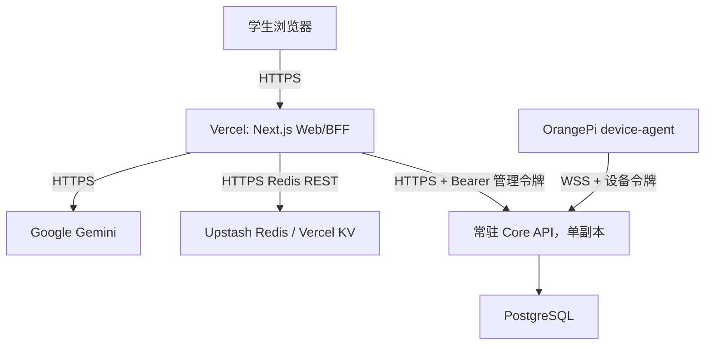

# P0 生产与比赛环境部署指南

本文给出当前代码可支持的部署拓扑和操作清单。它不是已部署证明：仓库中没有 Vercel 登录状态、项目绑定文件、云 Core API 地址、生产 Redis、PostgreSQL 或公网 WSS 的可验证记录。

## 1. 必须拆分的两个后端



| 部件 | 推荐运行位置 | 原因 |
|---|---|---|
| Next.js 学习网页和 Route Handlers | Vercel | 静态资源、HTTPS、Serverless/Fluid Compute 与 Git 部署 |
| AI 请求限流状态 | Upstash Redis 或兼容 Vercel KV REST | Vercel 多实例之间共享分钟/天配额与并发租约 |
| FastAPI Core API | 支持常驻容器与 WebSocket 的云主机/容器平台 | OrangePi 需要持续 WSS；在线连接当前保存在单进程内存 |
| 业务与设备数据 | 托管 PostgreSQL | Core API 已支持 `postgresql+asyncpg` 和 Alembic |
| OrangePi 代理 | 开发板 systemd | 开机自启、断线退避重连 |

Vercel 不能替代设备 WebSocket 网关。当前连接管理器没有 Redis Pub/Sub 或跨实例路由，因此 Core API 正式演示环境必须保持 **1 个应用副本**；多副本会导致命令可能发到没有该设备连接的实例。

## 2. 上线前准备

外部账号与资源必须由项目所有者完成：

1. 一个 Vercel 项目，项目根目录指向仓库根目录。
2. 一个 Gemini API Key，并确认比赛网络允许访问对应服务。
3. 一个 Redis REST 实例，获得 URL 和 Token。
4. 一个支持 HTTPS/WSS、常驻进程和自定义环境变量的 Core API 运行环境。
5. 一个 PostgreSQL 数据库及异步连接串。
6. 一个 Core API 公网域名，例如 `core.example.com`，证书覆盖 HTTPS 与 WSS。
7. 为 Core 管理接口和设备连接分别生成随机、不同的高强度令牌。

真实凭证只进入平台加密环境变量、Core secret store 和 OrangePi 的 `/etc/mambo/device-agent.env`。不要把值写入仓库、截图、比赛报告或聊天记录。

## 3. 部署 Core API

### 3.1 容器构建

必须从仓库根目录构建，因为 Dockerfile 会复制 `server/` 和根目录 `alembic.ini`：

```bash
docker build -f server/Dockerfile -t mambo-core:0.2 .
```

容器入口会先运行 `python -m alembic upgrade head`，然后以 `${PORT:-8000}` 启动 Uvicorn。

### 3.2 Docker Compose 单机栈

仓库根 `compose.yaml` 提供 PostgreSQL 16 + 单副本 Core API，适合开发、比赛服务器或单机容器主机。先在未跟踪的根 `.env` 中安全设置：

```text
POSTGRES_PASSWORD
DEVICE_AUTH_TOKEN
ADMIN_API_TOKEN
# 可选：CORE_API_PORT、HEARTBEAT_INTERVAL_SECONDS、DEVICE_STALE_AFTER_SECONDS
```

然后运行：

```bash
docker compose up --build -d
docker compose ps
docker compose logs --tail 100 core-api
```

Compose 会等待 PostgreSQL healthcheck，通过内部 `postgresql+asyncpg` 连接启动 Core，并把数据库保存在 `mambo-postgres` named volume。它默认把 Core 发布在主机 8000 端口，没有配置公网 TLS；生产必须放在 HTTPS/WSS 反向代理后，不能直接暴露明文端口。

`docker compose down` 不删除 named volume；不要在不确认备份的情况下执行带 `-v` 的删除。正式托管数据库时可单独部署 Core 容器并使用平台提供的 `DATABASE_URL`。

### 3.3 环境变量

| 变量 | 生产要求 | 说明 |
|---|---|---|
| `DEVICE_AUTH_TOKEN` | 必需 | 当前环境的设备 Bearer 令牌；与管理令牌不同 |
| `ADMIN_API_TOKEN` | 必需 | Web BFF 与管理员调用 Core REST API 的令牌 |
| `DATABASE_URL` | 必需 | `postgresql+asyncpg://...`；不要使用临时文件系统 SQLite |
| `AUTO_CREATE_SCHEMA` | 固定 `false` | 正式环境只通过 Alembic 迁移 |
| `HEARTBEAT_INTERVAL_SECONDS` | 可选，默认 5 | Welcome 消息中的心跳间隔，最小 2 秒 |
| `DEVICE_STALE_AFTER_SECONDS` | 可选，默认 20 | 离线判定配置，最小 10 秒 |
| `PORT` | 平台提供或默认 8000 | 容器监听端口 |

示意运行命令只展示变量名，不包含真实值：

```bash
docker run --rm -p 8000:8000 \
  -e DEVICE_AUTH_TOKEN \
  -e ADMIN_API_TOKEN \
  -e DATABASE_URL \
  -e AUTO_CREATE_SCHEMA=false \
  mambo-core:0.2
```

### 3.4 平台与反向代理要求

- 应用副本数固定为 1；不要启用会同时运行多个 Core 实例的自动扩缩容。
- 反向代理必须透传 `Upgrade` 和 `Connection`，允许 `/ws/v1/devices/*` 的长连接。
- 空闲连接超时应明显高于设备心跳周期；建议至少 60 秒。
- `/api/v1/health` 用作 HTTP 健康检查，但它当前只报告数据库“已配置”，不是实际数据库读写就绪探针。
- 设备在 `DEVICE_STALE_AFTER_SECONDS` 内没有有效消息时，网关以 `4008 device_inactive` 断开并持久化离线；代理应自动退避重连。
- 只向互联网开放 443；TLS 在平台或反向代理终止。开发端口 8000 不直接公网暴露。
- Web BFF 由服务端访问 Core API，因此当前不需要为浏览器放开跨域 CORS。
- Core 日志中不得记录 Authorization 头或完整未成年人内容。

### 3.5 数据库迁移与验证

容器启动会自动迁移。发布后仍应显式验证：

```bash
curl --fail --silent https://core.example.com/api/v1/health
curl --fail --silent \
  -H "Authorization: Bearer ${ADMIN_API_TOKEN}" \
  https://core.example.com/api/v1/devices
```

第二条命令只能在安全运维终端执行，避免 shell 历史和 CI 日志泄露令牌。预期响应结构是 `{ "items": [...], "count": n }`；不要把实际令牌或完整设备状态贴入报告。

### 3.6 PostgreSQL 运维

- 发布前创建一次数据库备份；迁移与应用部署作为同一发布步骤。
- 每日自动备份并设置保留期；定期做恢复演练，而不只是确认“备份任务成功”。
- 应用数据库账号只授予所需 schema 权限。
- SQLite 仅用于单机开发。容器临时文件系统中的 SQLite 会在重建后丢失，也不支持多实例。

## 4. 配置 OrangePi

在开发板的 `/etc/mambo/device-agent.env` 中保存：

```dotenv
DEVICE_ID=orangepi4pro-dev-01
DEVICE_AUTH_TOKEN=<由所有者安全写入，不能提交>
SERVER_WS_URL=wss://core.example.com/ws/v1/devices
HEARTBEAT_INTERVAL_SECONDS=5
STATUS_INTERVAL_SECONDS=10
LOG_LEVEL=INFO
```

`SERVER_WS_URL` 配置的是 WebSocket 根路径，代理会追加 `/{DEVICE_ID}`。先在当前 SSH 会话中手工运行代理验证，再由项目所有者安装/重启 systemd：

```bash
python -m device.agent
systemctl status mambo-device-agent --no-pager
journalctl -u mambo-device-agent -n 50 --no-pager
```

安装、复制到 `/opt`、写 `/etc` 与 `systemctl enable --now` 需要 `sudo`，必须由用户明确执行。当前协议仅支持 `ping` 和 `get_status`，不允许远程 Shell。

生产多设备前的阻断项：当前 Core 使用一个环境级 `DEVICE_AUTH_TOKEN`。必须改为每设备独立、可撤销凭证，再批量接入真实学校设备。

## 5. 配置 Vercel

### 5.1 项目设置

以仓库根目录作为 Project Root。仓库根 `vercel.json` 已声明：

```text
Install Command: npm install
Build Command: npm run build --workspace apps/web
Output Directory: apps/web/.next
Framework: Next.js
```

不要把 Vercel Root Directory 改成 `apps/web` 后仍期待根 `vercel.json` 生效；两种配置只能选择一种并验证。本项目推荐保持仓库根目录。

### 5.2 Web 环境变量

至少在 Preview 配置并验证，再复制到 Production：

```text
GOOGLE_GENERATIVE_AI_API_KEY
GEMINI_MODEL

UPSTASH_REDIS_REST_URL
UPSTASH_REDIS_REST_TOKEN
# 或者完整配置以下兼容组，不要混用半组：
KV_REST_API_URL
KV_REST_API_TOKEN

CORE_API_URL
CORE_API_ADMIN_TOKEN
CORE_DEVICE_ID
```

规则：

- `GOOGLE_GENERATIVE_AI_API_KEY`、Redis Token 和 `CORE_API_ADMIN_TOKEN` 都是 Secret；绝不使用 `NEXT_PUBLIC_`。
- `CORE_API_URL` 在 Vercel 必须是 `https://`。代码会拒绝生产环境的明文 HTTP。
- AI 限流首选一整组 `UPSTASH_REDIS_REST_*`；只有首选组不完整时才使用一整组 `KV_REST_API_*`。
- Vercel 自动注入 `VERCEL=1`，不需要用户设置。
- `CORE_DEVICE_ID` 为空时展示 Core 返回的第一台设备；比赛现场建议显式指定。

### 5.3 Redis 故障关闭

在 `VERCEL=1` 时，AI 路由不会退回进程内内存限流：

- Redis 凭证缺失、Redis 请求超时或响应异常：返回 `503 AI_GUARD_UNAVAILABLE`。
- 超过分钟/天/并发限制：返回 `429 RATE_LIMITED` 和 `Retry-After`。
- 课程、固定动画、种子绘本、材料、练习和编程实验仍可工作；对话和转写不可用。

这避免 Serverless 多实例各自计数而导致配额失控。比赛前要在 Preview 主动断开 Redis 做一次故障演练，再恢复并确认 AI 链路。

### 5.4 发布顺序

1. 将功能分支推送到 GitHub，等待 Vercel 创建 Preview。
2. 在 Preview 验证首页、`/lab`、`/progress`、材料下载和 `/api/device`。
3. 验证真实 Gemini 文本、单图和录音请求，不在日志输出密钥或媒体。
4. 验证 Redis 限流与 503 故障关闭。
5. 验证 Core API HTTPS 与 OrangePi WSS 同时在线。
6. 完成移动/桌面浏览器和 Office 文件手工验收。
7. 由仓库所有者合并到生产分支或在 Vercel 明确 Promote。

当前仓库只证明具备部署配置，不证明以上步骤已经执行。

### 5.5 GitHub Actions 发布前门禁

`.github/workflows/ci.yml` 在 push 和 pull request 上运行两个 job：

- Node.js 22：`npm ci`、Web tests、lint、typecheck、build、真实 Pyodide smoke。
- Python 3.12：安装 `server/requirements-dev.txt` 并运行 `pytest`。

合并生产分支前应把这两个 job 设为 required checks。Pyodide smoke 依赖固定 jsDelivr 网络，外部网络失败应记录并重跑，不能静默跳过。Actions 配置文件存在并不证明某个 commit 已通过，必须保存该 commit 的实际 run URL/ID。

## 6. 当前数据库边界

Vercel 网页当前 **不需要数据库也能演示**，因为学段、答题、掌握度、兴趣和绘本使用浏览器 `localStorage`。这也是明确限制：

- 同一个学生换浏览器、清缓存或换设备会丢失/隔离记录。
- 每门课程最多 20 条/20,000 字符的完整文字对话轮次保存在 localStorage，刷新可恢复；图片、录音二进制和 Python 源码不会持久化。录音转写被发送后属于文字历史。
- FastAPI 已有学生、课程、学习会话、消息和答题基础表，但 Web 尚未调用这些学习 API。
- 绑定 Vercel Postgres/Neon 不会自动让网页获得账号同步；仍需要身份、授权、数据迁移和 BFF/业务 API 集成。

比赛演示可以使用 localStorage，但报告和讲解必须称为“单浏览器演示档案”，不能称为生产学习档案或跨端同步。

## 7. 发布验证与回滚

发布前执行 [P0 发布验收清单](../verification/p0-release-checklist.md)。建议保存以下不可变证据：

- Git commit SHA、Vercel deployment URL 与 deployment ID。
- Core 镜像 digest、Alembic current revision、数据库备份编号。
- Preview/Production 环境变量**名称**清单，不保存值。
- HTTP 健康检查、WSS 连接、设备最后心跳的脱敏结果。
- 桌面/移动截图、材料文件、演示录屏和测试日志。

回滚时：

1. 先停止新版本流量，不回滚已应用的数据库迁移文件。
2. Vercel Promote 上一个已验证 deployment。
3. Core 运行上一个镜像 digest；确认其能兼容当前数据库 schema。
4. 检查 OrangePi 自动重连、网页模式降级和 Redis 租约过期。
5. 对数据迁移采用向前修复；只有经过恢复演练才能执行数据库回退。

## 8. 监控与现场预案

当前代码未集成集中式 tracing/APM。比赛现场至少人工监控：

- Vercel Function 5xx、429、执行时长与 Gemini 调用错误。
- Redis 可用性与配额。
- Core `/api/v1/health`、进程重启、WebSocket 连接数、设备最后心跳。
- PostgreSQL 连接、存储空间与备份。
- OrangePi 网络、音频输出、摄像头与 systemd 日志。
- Core 协议拒绝/关闭码、每设备状态历史增长（代码保留最近 1000 条）和重复消息情况。

现场降级顺序：Gemini 失败时展示固定课程/动画/种子绘本/练习/实验；机器人失败时界面自动显示网页模式；公网 WSS 失败时不现场修改设备凭证，切换预先验证的备用网络和 Core 地址。

## 9. 仅项目所有者能完成的事项

- 登录并确认 Vercel 项目、Git 分支、域名和 Production promote 权限。
- 创建/绑定 Redis REST，并把 Secret 写入 Preview/Production。
- 创建 PostgreSQL、Core 容器服务、公网域名和 TLS/WSS。
- 安全设置 Gemini、Core 管理、设备与数据库凭证。
- 在 OrangePi 上执行需要 `sudo` 的文件安装和 systemd 操作。
- 轮换任何曾在聊天、截图或终端历史中暴露的 API Key/Token。
- 取得真实学生/教师测试、未成年人监护/同意和内容审核所需授权。

这些外部动作不能由仓库代码代替，也不能在未验证时写成“已完成”。
