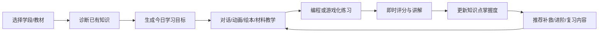
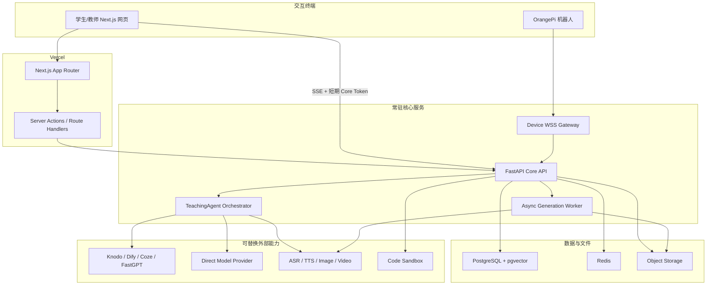
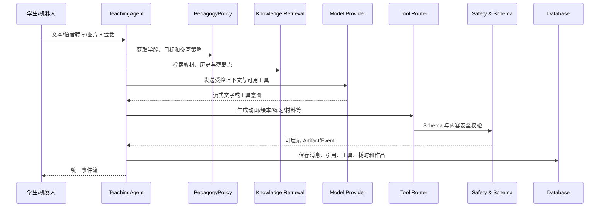
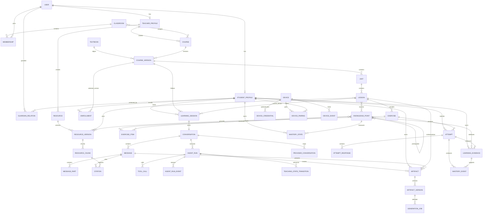

# Mambo K12 AI 教学助手产品与技术设计

> - 赛题：JBGS-2026-02 多模态 K12 人工智能通识课教学助手对话智能体
> - 文档版本：v1.0
> - 状态：v1.0 设计基线
> - 日期：2026-07-17
> - 代码基线：`3c3f09b`
> - 目标：作为后续产品、前端、服务端、智能体、硬件和项目报告的统一实施依据

## 1. 结论摘要

本项目不应被设计成“机器人连接服务 + 一个聊天页面”，而应被设计成完整的 K12 AI 教学产品：网页是学生和教师的主要使用界面，OrangePi 机器人是同一学习系统的第二交互终端，智能体平台只是可替换的模型能力供应商。

核心定位如下：

1. **网页是主产品**：学生在网页完成课程学习、对话、动画、绘本、编程和游戏化练习；教师在网页维护课程与查看学习分析。
2. **服务端是唯一业务中枢**：身份、课程、知识库、学习记录、个性化、生成作品和硬件状态均由自己的服务端保存，不能交给 Knodo 或其他平台作为唯一数据源。
3. **智能体平台可替换**：优先实现自己的 `TeachingAgent` 编排层；Knodo、Dify、扣子、FastGPT 或直接模型 API 均通过 Provider 接口接入。
4. **六种多模态能力全部是 P0**：不仅要有入口，还必须能操作、生成或上传、保存、回看，并产生学习记录。
5. **模型只负责理解与生成，程序负责执行与校验**：动画、绘本、题目、课程和硬件命令使用结构化协议，由确定性程序渲染或执行，不运行模型生成的任意 HTML、JavaScript 或 Shell。
6. **Vercel 不承担硬件长连接**：Next.js 网页部署到 Vercel；现有 FastAPI 演进为教学核心 API 与设备网关，部署到支持常驻进程和 WebSocket 的云主机或容器平台。

推荐的第一主方案是：

- Next.js App Router 学生端与教师端，部署 Vercel。
- 现有 FastAPI 继续演进为模块化核心服务。
- 自研 `TeachingAgent`，优先使用与 FastAPI/Pydantic 技术栈一致的 PydanticAI 类代码型框架；模型供应商和智能体平台通过适配器替换。
- PostgreSQL + pgvector 保存业务数据和知识向量。
- Redis + Python Worker 执行绘本、PPT、Word、音视频等长任务。
- Vercel Blob 或 S3 兼容存储保存图片、音频、视频和文档。
- OrangePi 通过独立 WSS 设备网关接入同一学习会话。

## 2. 设计范围

### 2.1 本文覆盖

- 赛题需求与评分项追踪。
- 学生端、教师端、管理端和机器人端产品设计。
- 四学段适配策略。
- 对话、教学材料、动画、绘本、编程和游戏化练习六种能力。
- 个性化学习路径与主动教学状态机。
- 智能体平台选型与可替换架构。
- 知识库、RAG、内容生成和安全校验。
- 数据模型、API、事件协议和硬件协同。
- Vercel 与核心服务的部署边界。
- 安全、隐私、测试、验收、排期、风险和项目报告证据。

### 2.2 P0 最小纵向闭环

六种能力均为 P0，但不等于首期实现每种能力的所有变体。P0 按以下范围锁定，新增内容必须先替换而不是叠加：

| 能力 | P0 必达 | P1 扩展 |
|---|---|---|
| 对话 | 流式文本、浏览器语音输入/朗读、单图片提问、历史恢复 | 实时双工语音、更多视觉输入 |
| 教学材料 | 视频/PDF/DOCX/PPTX 上传与推荐；DOCX 或 PPTX 二选一真实生成 | 两种都生成、短视频自动合成 |
| 动画 | 冒泡排序、神经网络 2 个高质量交互模板 | 二分查找、分类训练和通用模板编辑器 |
| 绘本 | 4-8 页、插图、旁白、页内问题、保存回看 | 角色重绘、分支剧情、视频绘本 |
| 编程 | Monaco + Python/Pyodide + 测试用例 | Blockly、多语言、远程微虚拟机 |
| 游戏练习 | 单选、排序、代码追踪 3 种题型 | 多选、配对、填空及更多游戏机制 |
| 个性化 | 掌握度、错题补救、先修约束和推荐原因 | BKT/IRT、班级对照分析 |
| Agent Provider | Mock + 1 个正式 Provider | 在线多 Provider 自动故障切换 |

比赛纵向切片优先固定“冒泡排序”和“神经网络/图像分类”两个主题，把六种能力在这两个主题上打通。P0 的协议保持可扩展，但“任意主题高质量生成”和完整教师 CMS 属于泛化层，不能挤占可重复演示的时间。

### 2.3 当前不作为首期目标

- 通用社交、公开内容社区和学生间私聊。
- 对学生进行医学、心理或自闭症诊断。
- 持续上传摄像头原始视频进行云端监控。
- 让大模型直接控制电机、执行 Shell 或运行任意网页代码。
- 自研基础大模型、ASR、TTS、图片或视频生成基础模型。
- 首期支持所有编程语言；P0 聚焦 Python，并给低龄学生提供积木或可视化交互。

## 3. 设计原则

| 原则 | 具体约束 |
|---|---|
| 教育目标优先 | 每次智能体调用都要关联学段、课程目标或知识点，不能退化成通用闲聊机器人。 |
| 学段策略确定化 | 年龄适配由版本化策略和测试集保证，不只依赖一段提示词。 |
| 内容可追溯 | 教材事实回答保留引用；生成作品保留来源、模型、提示词版本和审核记录。 |
| 业务状态自持 | 平台会话 ID 可以保存，但学生画像、学习历史和掌握度必须在自己的数据库中。 |
| 生成与执行分离 | 模型输出结构化 Spec，后端校验，前端使用白名单渲染器展示。 |
| 安全默认开启 | 未成年人数据最小化、角色隔离、内容前后置审核、设备命令白名单和代码沙箱。 |
| 渐进交付 | 每个阶段必须形成可演示闭环，不集中到最后一次性集成。 |
| 可替换供应商 | 智能体、模型、ASR、TTS、图片生成、对象存储均通过接口封装。 |
| 可观测可评测 | 每个回答和生成任务有 trace ID、耗时、状态、引用、成本与评测结果。 |

## 4. 当前系统基线与缺口

当前仓库已经完成以下基础：

- OrangePi WebSocket 自动重连、心跳、系统状态上报。
- 设备令牌和管理令牌鉴权。
- `ping`、`get_status` 白名单命令。
- 设备、状态历史和命令结果持久化。
- 学生、课程、学习会话、对话消息与答题记录基础表。
- SQLAlchemy、Alembic、SQLite/PostgreSQL 连接能力。
- FastAPI OpenAPI、Dockerfile、systemd 和 6 项自动化测试。

现有实现只解决了“设备能连接、基础数据能保存”，尚未形成教育产品。关键缺口如下：

| 领域 | 当前状态 | 目标状态 |
|---|---|---|
| 前端 | 无 | 学生学习工作台、教师后台、管理与设备页面。 |
| 身份 | 所有学习 API 共用管理员令牌 | 用户会话、学生/教师/管理员角色与资源级授权。 |
| 学段 | 只有四学段字段与课程匹配 | 年级、教材、表达风格、难度、交互形式和评测规则。 |
| 智能体 | 消息只能由 API 人工写入 | 流式回答、工具调用、主动教学、引用和运行追踪。 |
| 多模态 | 只有通用 JSON 字段 | 六种可运行能力和版本化内容协议。 |
| 知识库 | 无 | 教材上传、解析、切片、检索、引用和教师审核。 |
| 个性化 | 只有兴趣和答题历史 | 知识点掌握度、薄弱点、复习计划和可解释推荐。 |
| 硬件协同 | 仅状态查询 | 配对、共享会话、语音、视觉事件和屏幕内容同步。 |
| 生产能力 | 单机 SQLite | PostgreSQL、对象存储、异步任务、监控、备份与限流。 |

在进入公网前还必须修复：单设备凭证、心跳超时离线、命令超时、消息幂等、状态历史保留策略、CORS、审计、限流和数据库真实就绪检查。

## 5. 用户与核心场景

### 5.1 用户角色

| 角色 | 主要目标 | 权限边界 |
|---|---|---|
| 学生 | 学习课程、提问、完成作品和练习、查看个人进度 | 只能访问自己的档案、会话和作品。 |
| 教师 | 建课程、上传资料、审核生成内容、查看学生学习分析 | 只能访问所属班级和课程。 |
| 管理员 | 管理平台配置、智能体 Provider、设备和审计 | 不默认查看学生对话正文，敏感访问需要审计。 |
| 评委演示账号 | 无配置成本体验完整演示 | 使用隔离的种子数据，定时重置，不接触真实学生数据。 |
| OrangePi 设备 | 作为已配对学生的语音、视觉和屏幕终端 | 使用单设备凭证，只能执行白名单能力。 |

学生首期不要求提供真实姓名、精确生日、学校全称等不必要信息。建议由教师或监护账号创建学生子档案，学生使用班级码、昵称和本地 PIN 进入。

### 5.2 核心学习闭环



智能体必须既能响应学生主动提问，也能在以下节点主动发起教学：

- 新章节开始时说明目标并询问已有认知。
- 学生长时间无操作时提供一个具体可选行动，不连续打扰。
- 回答后提出理解检查或推荐可视化内容。
- 答错后先定位误区，再给提示和补救内容。
- 课末总结已掌握、待复习和下一步，不使用空泛鼓励。

## 6. 四学段适配策略

学段适配必须是可配置、可版本化、可自动评测的 `PedagogyPolicy`，并与课程知识图谱共同进入智能体上下文。

| 学段 | 默认交互 | 表达与深度 | 编程形式 | 练习策略 | 单轮控制 |
|---|---|---|---|---|---|
| 小学低年级 | 语音、绘本、动画、点击游戏 | 具体事物和故事类比；避免长定义与公式 | 顺序、分类、拖拽、积木概念 | 1 个目标、即时反馈、少量选项 | 回答通常 1-3 个短句，随后互动 |
| 小学高年级 | 对话、动画、小游戏、短代码 | 生活例子后引入术语；解释因果 | Blockly、Python 片段 | 多步提示、分类与排序 | 每段一个概念，配图或例子 |
| 初中 | 对话、实验、Python、项目任务 | 概念、流程、简单算法和数据意识 | Python、可视化调试、测试用例 | 解释错误原因，逐步减少提示 | 允许结构化长回答但先给摘要 |
| 高中 | 算法、完整代码、数学直觉、项目式学习 | 严谨定义、复杂度、模型局限与伦理 | Python 项目、算法实现、数据实验 | 测试驱动、开放题、反思 | 先结论，再推导、代码和扩展 |

同一知识点不能只替换措辞。例如“神经网络”：

- 小学低年级：以多个“小帮手”传递信号的绘本解释分类。
- 小学高年级：用输入、线索和投票动画解释层级处理。
- 初中：解释节点、权重、激活和训练，并做简单分类实验。
- 高中：解释矩阵计算、损失、梯度下降、过拟合和模型评估。

每次 Agent Run 保存 `policy_version`，确保比赛报告能够复现不同学段的输出。

## 7. 产品信息架构与页面设计

### 7.1 页面结构

```text
/learn                         学生首页：今日任务、继续学习、路径与薄弱点
/learn/session/{id}            对话式课堂与多模态教学画布
/learn/courses                 课程、教材和章节
/learn/storybooks              已生成绘本与作品集
/learn/lab                     编程实验室
/learn/practice                游戏化练习与错题本
/learn/progress                掌握度、学习历史和推荐原因
/devices                       机器人配对、在线状态和当前会话

/teacher/courses               课程、单元、课时和知识点编辑
/teacher/resources             视频、文档、PPT、教材上传与审核
/teacher/students              学生进度、薄弱点和作品
/teacher/content-jobs          生成任务、预览、审核、发布和重试

/admin/providers               智能体、模型、ASR/TTS 和媒体 Provider
/admin/devices                 设备、凭证、事件与命令
/admin/audit                   内容安全、调用链和操作审计
```

登录后首屏直接进入学习工作台，不制作占据首屏的营销落地页。

### 7.2 主学习工作台

桌面端采用稳定三栏结构：

```text
┌────────课程/路径────────┬────────对话课堂─────────────┬────教学画布────┐
│ 今日目标                │ 智能体消息与引用              │ 动画/绘本      │
│ 章节导航                │ 学生文本、语音、图片输入      │ 代码/练习      │
│ 掌握度与复习提醒        │ 主动提问与快捷建议            │ 材料预览       │
└─────────────────────────┴──────────────────────────────┴────────────────┘
```

- 中间对话区是持续主流程，不因打开作品而丢失。
- 右侧教学画布根据 `artifact_ready` 事件切换动画、绘本、代码或练习。
- 学生可以将画布最大化，返回后对话滚动位置保持不变。
- 移动端改为“对话/内容/路径”三个标签页，不能压缩成重叠的三栏。
- 所有生成任务显示明确的排队、生成、可预览、失败和可重试状态。
- 图标使用一致的图标库，陌生图标必须有 tooltip；数值、棋盘和动画区域使用稳定尺寸避免跳动。

### 7.3 低龄与高龄差异

差异不只体现在颜色：

- 低龄模式提高语音和大目标点击控件的优先级，减少同时显示的信息。
- 高中模式默认显示引用、代码、变量状态和扩展问题。
- 动效只用于解释状态变化和给予反馈，不使用干扰阅读的装饰动画。
- 支持字幕、朗读速度、暂停、键盘操作和减少动态效果。

## 8. 总体技术架构

### 8.1 逻辑架构



### 8.2 部署职责

| 部署单元 | 运行位置 | 职责 |
|---|---|---|
| `apps/web` | Vercel | 页面渲染、用户交互、轻量 BFF、Core Token 交付和上传签名。 |
| `server` | 支持常驻进程的云主机/容器 | 业务 API、智能体编排、SSE、设备 WSS、鉴权与数据一致性。 |
| `worker` | 与核心服务同区域的 Worker | 文档、PPT、绘本、音视频等长任务与重试。 |
| PostgreSQL | 托管 PostgreSQL | 唯一业务真源、pgvector 知识检索、备份。 |
| Redis | 托管 Redis | 任务队列、限流、短期事件和多实例设备路由。 |
| Object Storage | Vercel Blob 或 S3 兼容服务 | 图片、音频、视频、文档、课件和生成作品。 |

**关键决策**：Next.js 不直接拥有第二套业务数据库。FastAPI 是业务数据的唯一写入边界；Next.js 的 Server Components、Server Actions 和 Route Handlers 调用 Core API。这样保留现有代码和 Alembic 数据模型，同时避免 TypeScript/Python 双 ORM 漂移。

主链路明确如下：普通页面读取和变更经 Next.js BFF；对话事件流由浏览器携带短期、仅限单次 Run 的 Core Token 直连 FastAPI，CORS 只允许正式网页域名。BFF 使用服务身份调用 Core，并同时传递已验证的终端用户 subject。这样不暴露 Provider 密钥，也避免让 Vercel Function 长时间代理每次对话。

Vercel Functions 适合页面、短 API 和流式响应，但绘本、PPT、Word、视频和批量知识库解析属于可重试的长任务，应提交给常驻 Worker。硬件 WebSocket 同样保留在常驻服务中。

### 8.3 仓库目标结构

```text
apps/
  web/                       Next.js 学生端、教师端与 BFF
server/
  app/
    identity/                身份、角色、班级和授权
    curriculum/              教材、课程、课时与知识点
    knowledge/               资源、解析、RAG 和引用
    conversation/            会话、消息部件和事件流
    agent/                   教学编排、策略、工具和 Provider
    artifacts/               动画、绘本、文档和媒体作品
    assessment/              题库、判题、错题和奖励
    personalization/         掌握度、复习与推荐
    coding/                  编程项目和运行记录
    devices/                 设备网关、配对、事件和命令
    safety/                  审核、审计和隐私
  worker/                    异步任务入口
device/                      OrangePi agent
packages/
  contracts/                 OpenAPI/JSON Schema 生成的共享类型
  content-specs/             动画、绘本、练习等版本化协议
docs/                        设计、部署、测试和报告证据
```

首期仍采用模块化单体，不立即拆成大量微服务。只有设备连接量、生成任务或团队边界证明需要时再拆分部署。

## 9. 智能体平台与自研编排设计

### 9.1 选型结论

本项目不能把“完整智能体”理解为在某个平台里配置一个 Prompt。推荐由自己的服务端实现 `TeachingAgent`，平台只提供模型、知识库或工作流加速能力。

由于当前服务端已经使用 FastAPI 与 Pydantic，代码型主方案优先采用 PydanticAI 一类支持类型化工具、结构化输出、流式事件和多模型适配的成熟框架。框架负责可靠调用，课程状态机、权限、个性化和 Artifact 协议仍由本项目定义，不能把核心业务反向绑定到框架内部对象。

| 方案 | 优势 | 主要风险 | 在本项目中的定位 |
|---|---|---|---|
| 自研代码编排 | 结构化输出、工具、安全、个性化和硬件控制最可控；可自动测试 | 开发量高于纯低代码 | **推荐主方案**，使用 Python 类型模型和成熟 Agent 框架。 |
| Knodo | 与比赛组织方生态可能更贴合；公开文档已有 Chat/SSE/文件 API | 比赛租户配额、附件协议和部分多模态能力待实测 | 通过 `KnodoProvider` 接入，完成契约测试后决定是否作为正式 Provider。 |
| Dify | 可视化工作流、知识库、云端或自部署 | 增加一套平台运维；业务状态仍需同步 | 教师快速调 Prompt 或作为备用 Provider。 |
| FastGPT | 中文生态、知识库与可视化流程 | 平台协议与核心业务耦合风险 | 可作为 RAG/问答 Provider，不作为学习记录真源。 |
| Coze/扣子 | 快速搭建工作流、插件和知识库 | 平台限制、配额和可迁移性需要实测 | 比赛快速 POC 或备用 Provider。 |
| 直接模型 API | 链路最短、供应商可选 | RAG、工具和运行追踪需要自己实现 | 自研编排层的默认底座和平台故障降级。 |

候选平台必须通过同一套技术试验，不按宣传页决定：

1. 是否有服务端 API 与独立密钥权限。
2. 是否支持流式输出和会话续接。
3. 是否支持图片/音频/文件输入。
4. 是否支持结构化输出或工具调用。
5. 是否能返回知识库引用和来源。
6. 是否有超时、限流、并发、回调与错误码说明。
7. 是否能导出配置、版本化并支持测试环境。
8. 是否允许在比赛和公开部署中使用。

### 9.2 Knodo 已确认的接口边界

根据 2026-07-17 可访问的 Knodo 官方公开 API 文档，当前暂定以下契约；实现时必须保存脱敏请求/响应夹具并用比赛租户复验：

- PAT 在个人设置中创建，值以 `jvs_` 开头且只显示一次；支持能力类别和组织/工作空间/会话资源范围。
- 所有 Knodo PAT 只能保存在 FastAPI 服务端，使用 `Authorization: Bearer <PAT>` 调用，不能进入网页或 OrangePi。
- 工作空间 Chat 可先调用 `POST /api/v1/workspaces/{workspaceId}/chat/submit`，再使用返回的 `conversationId` 和 `activeResponseId` 订阅 SSE。
- SSE 接口支持 `expectedResponseId`、`fromIndex` 和 `eventIndex`，可以实现断线恢复；事件包含内容、工具调用、工具结果、结束和错误等类型。
- 另有 OpenAI Chat Completions 兼容的 `POST /api/v1/bots/{botId}/chat/completions`，支持流式响应和 `conversationId` 续聊。
- 提供会话列表、消息、状态和知识库文件 API；`chat-upload` 支持常见图片、PDF、Office、文本和代码文件，公开文档标注单文件最大 10 MB。

由此产生以下约束：

1. 浏览器不直接连接 Knodo。原生 `EventSource` 无法安全携带 PAT，由 FastAPI 代理 Knodo SSE 并转换为本项目统一事件流。
2. Knodo 外部会话与内部学生没有天然关联，必须保存 `(internal_session_id, provider, external_conversation_id, external_response_id)` 映射。
3. 公共 Bot Chat 文档主要明确文本请求；图片/音频附件如何绑定到本轮外部对话仍需使用比赛账号做契约试验。
4. 官方没有提供动画、绘本、PPT/Word、视频、代码执行和游戏化练习的统一生成 API；这些能力继续由本项目 Tool/Job/Artifact 服务实现。
5. Knodo 记忆或知识库不能替代学生掌握度和学习历史数据库。

P0 只实现 Mock 和一个通过试验的正式 Provider。若 Knodo 契约试验通过，就以 Knodo 为正式 Provider；否则使用 Direct Model Provider。Dify 保留为 P1 适配点，避免首期同时维护三套真实连接。

### 9.3 Provider 接口

业务代码只依赖统一接口：

```python
class AgentProvider(Protocol):
    async def stream(self, request: AgentRequest) -> AsyncIterator[ProviderEvent]: ...
    async def health(self) -> ProviderHealth: ...

class SpeechProvider(Protocol):
    async def transcribe(self, audio: AudioInput) -> Transcript: ...
    async def synthesize(self, text: str, voice: VoiceConfig) -> AudioArtifact: ...

class ImageProvider(Protocol):
    async def generate(self, request: ImageRequest) -> ImageArtifact: ...

class EmbeddingProvider(Protocol): ...
class Reranker(Protocol): ...
class DocumentParser(Protocol): ...
```

P0 提供：

- `MockTeachingProvider`：本地和 E2E 测试输出固定事件。
- `KnodoProvider` 或 `DirectModelProvider`：只选择一个作为正式运行实现。
- Provider 级超时、熔断、重试和降级，不在页面里处理供应商差异。

P1 再实现第二个正式 Provider，并使用相同契约测试验证切换不修改页面和学生数据。

### 9.4 教学智能体职责

`TeachingAgent` 的一次运行包含：



智能体不直接：

- 修改掌握度；只能提交证据，由 `MasteryService` 计算。
- 判定客观题；由确定性评分器判定。
- 运行学生代码；由浏览器隔离 Worker 或代码沙箱运行。
- 下发任意硬件操作；由设备能力白名单和授权服务转换。
- 发布教材内容；生成后需要自动校验，教师资源可配置人工审核。

### 9.5 主动教学状态机

```text
OPENING -> DIAGNOSE -> TEACH -> CHECK -> PRACTICE -> REFLECT -> RECOMMEND
                  ^       |          |          |
                  └──── remediation ─┴──────────┘
```

状态转换由程序保存，模型负责生成该状态下的自然语言。刷新、切换网页或机器人后仍能继续，不依赖模型“记住”当前阶段。

### 9.6 统一事件流

网页和机器人消费同一组服务端事件：

```text
run_started
text_delta
citation
tool_started
tool_progress
artifact_ready
quiz_ready
learning_update
suggested_action
run_completed
run_failed
```

事件包含 `event_id`、`run_id`、`sequence`、`timestamp`、`type` 和经过 Schema 校验的 `data`。客户端按 `sequence` 去重，并可使用最后事件 ID 恢复流。

### 9.7 模型调用与成本策略

模型选择由任务路由器决定，不让所有步骤都调用最昂贵模型：

| 任务 | 策略 |
|---|---|
| 意图、学段和工具路由 | 优先确定性规则；规则不足时使用低延迟小模型和结构化输出。 |
| 教材事实问答 | RAG 后调用主文本模型，强制引用并限制上下文。 |
| 动画/题目/绘本计划 | 使用支持结构化输出的模型，只生成 Spec，不生成任意执行代码。 |
| 图片、ASR、TTS | 交给对应专用 Provider，不把二进制重复塞入文本上下文。 |
| 安全与质量评测 | 规则优先；离线批量评测可使用独立 Judge，不能让同一次生成自我打分。 |

每个 Run 设置最大工具步数、Token/字符预算、检索片段数、总超时和单工具超时。上下文只发送最近消息、版本化摘要、当前目标、必要学习画像和检索片段，不反复发送全部历史。已发布 Artifact、教材检索和 TTS 结果按内容 hash 缓存；热门课程内容可以预生成。`provider_usage` 记录模型、Token、媒体数量、耗时和估算成本，并可按学生、班级和环境设置额度。

## 10. “知识内容编译器”

本项目的核心创新不是让大模型任意生成网页，而是将教学意图编译成受约束作品：

```text
教学目标
  -> 内容计划
  -> 版本化 ArtifactSpec
  -> JSON Schema/Pydantic 校验
  -> 年级、安全与事实检查
  -> 确定性渲染器
  -> 可保存、可回放、可评测的作品
```

`Artifact` 保存作品身份、所有者和 `current_published_version_id`；每次生成或单页重绘创建新的 `ArtifactVersion`。发布/审核状态属于版本，失败属于 GenerationJob，不混入作品状态。

```text
artifact_id
kind
owner_student_id / owner_teacher_id
current_published_version_id

artifact_version_id
artifact_id
schema_version
stage
course_id / lesson_id
knowledge_point_ids
title
status: draft | review | published | rejected | archived
source_run_id
provider
prompt_version
content_spec
asset_urls
created_at / published_at
```

模型生成的 Spec 失败时最多进行一次“带校验错误的修复生成”；仍失败则使用教学模板降级，不能把错误 JSON 或空白画布展示给学生。

## 11. 六种多模态能力详细设计

### 11.1 对话问答

- **输入**：文本、语音、图片、当前页面选择、机器人结构化视觉事件。
- **输出**：流式文字、引用、TTS 音频、推荐问题以及其他 Artifact。

实现要求：

- 支持连续追问、停止生成、重新生成和从失败处重试。
- 浏览器使用 MediaRecorder 录音，服务端通过 `SpeechProvider` 转写；TTS 生成音频和时间戳字幕。
- 图片先执行类型、大小、安全和隐私检查，再进入视觉模型或平台。
- 教材事实回答默认携带引用；无足够依据时明确说明并建议教师资源。
- 每条消息拆成 `MessagePart`，支持 text、audio、image、citation、artifact_ref、quiz_ref、code_ref。
- 页面刷新后恢复消息、作品和未完成任务。

验收：同一问题在四学段有实质差异；可语音提问、图片提问、连续追问；回答和引用可回看。

### 11.2 多模态教学材料

- **资源类型**：视频链接/上传视频、DOCX、PPTX、PDF、图片、音频、网页链接。
- **生成类型**：课程讲义、学习单、PPT、复习卡、教师教案，视频首期以审核后的上传和推荐为主。

资源流水线：

```text
上传/生成 -> 病毒与类型检查 -> 文本/页面提取 -> 元数据标注
-> 知识点切片与向量化 -> 教师审核 -> 发布 -> 推荐与引用
```

- 浏览器直传对象存储，避免大文件经过 Vercel Function。
- `ResourceVersion` 保存文件 hash、来源、教材版本、适用学段和审核人。
- PPT/Word 由模型生成结构化 LessonDocumentSpec，再由 Python Worker 使用固定模板渲染。
- 不允许模型直接拼装不可控 OOXML；模板负责版式、页码、引用和导出。
- 视频推荐只能来自教师上传或允许的资源目录，保留来源链接和适龄标签。
- P2 可把幻灯片、TTS 和字幕通过 Worker 合成为短讲解视频。

验收：所有资源类型可上传、关联知识点、预览/下载和推荐；至少 DOCX 或 PPTX 有真实生成链路。两个锚点主题共 10 个固定输入变体生成的文件必须能被 Office/LibreOffice 打开，标题、知识目标、正文、引用和下载均完整，不能只生成改后缀的文本文件。

### 11.3 动画讲解

动画使用白名单 `AnimationSpec`，而非模型生成 JavaScript。

```text
template: sorting | search | graph | neural_network | classification | timeline
entities: 可视对象与初始状态
steps: 状态变化、强调、旁白和检查点
controls: play | pause | next | previous | speed | reset
```

动画模板规划：

1. P0 冒泡排序：数组比较、交换、轮次、比较次数。
2. P0 神经网络：输入、权重信号、隐藏层、输出和预测。
3. P1 二分查找：范围缩小、中点和命中状态。
4. P1 分类训练：样本、决策边界和错误点。

前端使用 React + Canvas/SVG/Motion 等成熟渲染能力；动画状态由 reducer 驱动，支持单步和确定性回放。动画中的问题可以生成 `MasteryEvent`，但动画本身不能直接修改成绩。

验收：冒泡排序和神经网络至少各有一个可播放、暂停、单步、调速和重置的真实动画，首次渲染目标不超过 2 秒。

### 11.4 绘本生成

`StorybookSpec` 包含：封面、角色、页面、插图提示、旁白、对白、知识目标、页内互动题和结尾总结。

生成流程：

1. 教学智能体根据学段和知识点生成故事大纲。
2. 内容安全与事实检查通过后生成分页文本。
3. `ImageProvider` 生成角色一致的插图；失败时使用审核过的素材库，不显示空图。
4. TTS 生成逐页旁白和字幕。
5. 保存版本，允许教师审核、学生收藏、继续阅读和重新生成单页。

必须限制页数、文本长度、角色数量和图片尺寸。低龄绘本强调一页一个概念；高中默认不推荐绘本，除非学生主动选择类比讲解。

验收：输入知识点后生成 4-8 页绘本，可翻页、朗读、回答页内问题、保存和回看；两个锚点主题共 20 个固定输入变体中，所有页面与图片加载成功率不低于 95%，教学事实和适龄性量表平均至少 4/5，失败任务必须能重试或使用已审核素材降级。

### 11.5 编程环境

P0 使用成熟组件而非自研解释器：

- 编辑器：Monaco Editor。
- Python 执行：Pyodide 放在 Web Worker 中运行。
- 判题：确定性测试用例，不由大模型判断是否正确。
- AI 辅助：只解释错误和提供分级提示，不直接覆盖学生全部代码。

Pyodide Web Worker 主要提供可终止性和主线程隔离，**不是对恶意代码的强安全沙箱**。P0 威胁模型是受引导的学生练习，仍需增加：

- 在独立来源的 iframe/子域运行，不携带主应用 Cookie、令牌或本地存储。
- 配置严格 CSP，至少限制 `connect-src 'none'`，并禁止导航、弹窗和跨来源访问。
- Worker 单次运行超时后直接终止并重建。
- 限制输出长度、代码大小和允许导入的库。
- 每次运行保存代码快照、测试结果、耗时和错误分类。

P0 浏览器结果只能作为低权重形成性证据，客户端不能决定正式成绩。P1 的 Blockly、多语言、依赖安装和正式代码题使用 Vercel Sandbox/独立 Firecracker 容器等成熟隔离服务，以隐藏测试重新判定；每次执行使用临时环境、CPU/内存/时长限制和网络策略。浏览器 Worker 的测试结果不能替代服务端沙箱安全测试。

验收：学生可修改预置代码、运行、查看 stdout/错误、通过测试、重置和请求分级提示；超时保护有效，结果进入学习记录。

### 11.6 游戏化练习

P0 题型为单选、排序和代码追踪；P1 再加入多选、判断、配对、填空和代码测试。题目使用 `ExerciseSpec`，包含标准答案、评分规则、提示阶梯和补救讲解。

原则：

- 客观题由程序 100% 确定性评分。
- 错题先说明错误原因，再给提示；不能只展示答案。
- 奖励表现进步、持续学习和纠错，不用排行榜制造不必要比较。
- XP、连续学习、徽章与知识掌握度分离；奖励值不能伪造成学习能力。
- `formative_practice` 通过 Schema、答案一致性和规则校验后可立即作答，只产生低权重学习证据。
- `graded_assessment` 必须经过教师审核并发布，才计入正式成绩。

验收：生成后可真实作答、即时评分、查看解释、记录错题并触发补救推荐。

## 12. 知识库与 RAG

### 12.1 内容层级

```text
Textbook/Curriculum
  -> CourseVersion
    -> Unit
      -> Lesson
        -> KnowledgePoint
          -> ResourceVersion
            -> ResourceChunk
```

每个知识点包含先修关系、学段、目标、常见误区、示例、评测标准和审核状态。

### 12.2 检索流程

1. 使用当前学段、教材、课程和知识点做权限与元数据过滤。
2. PostgreSQL 全文检索与 pgvector 向量召回并行执行。
3. 合并、去重、重排，控制上下文长度。
4. 将来源 ID、页码、标题和片段传给模型。
5. 回答中的引用必须能映射回已发布资源。
6. 没有足够证据时降低置信度，避免编造教材结论。

知识库中的网页、文档和模型输出均视为不可信输入，必须防止文档内提示注入影响系统指令或工具权限。

Embedding、重排和文档解析均通过 Provider 接口封装。Phase 0/1 先使用版本化种子脚本导入两个演示主题的权威资源，完成最小“切片 -> 索引 -> 检索 -> 引用”链路；Phase 4 再开放教师自助上传和批量重新索引。

### 12.3 内容治理

- `draft -> processing -> review -> published -> archived` 生命周期。
- 教师上传内容默认不对所有学生发布。
- 资源更新生成新版本，历史会话仍能指向当时版本。
- 记录解析器版本、切片策略和 embedding Provider，便于重新索引。
- 为比赛构建小而精的权威知识库，优先覆盖演示课程和评测集，不追求无边界抓取。

## 13. 个性化学习路径

### 13.1 学习者模型

`StudentProfile` 包含学段、年级、教材、兴趣、交互偏好、无障碍设置和目标；`MasteryState` 按学生与知识点保存：

```text
mastery_score       0..1
state_confidence    0..1
evidence_count
last_practiced_at
next_review_at
misconception_tags
updated_reason
```

### 13.2 掌握度更新

P0 使用透明、可测试的证据更新，而不是让大模型返回一个分数：

```text
evidence_value = correctness_score + transfer_bonus
evidence_reliability = source_weight * verification_weight * hint_factor

new_mastery = clamp(
    old_mastery
    + alpha * evidence_reliability * difficulty_weight
    * (evidence_value - old_mastery)
)
```

- `alpha`、证据来源、提示因子和难度权重按版本保存。
- 一次偶然错误不能让掌握度剧烈下降。
- P0 不因答题耗时直接扣分，耗时只用于调整节奏和推荐；避免惩罚阅读较慢或有无障碍需求的学生。
- 代码隐藏测试、客观题、动画检查点和课后复述使用不同 `evidence_reliability`。
- 掌握度只使用服务端验证的 `LearningEvidence`；每次变化生成可撤销的 `MasteryEvent`，记录来源、输入证据和公式版本。

P1 可在足够真实数据后评估 Bayesian Knowledge Tracing 或 IRT，不能在没有数据时用复杂模型包装随机推荐。

### 13.3 下一步推荐

推荐候选必须满足课程权限和先修关系，排序参考：

```text
40% 薄弱程度
20% 先修准备度
15% 课程优先级
10% 复习到期程度
10% 兴趣匹配
 5% 交互形式多样性
```

推荐结果保存原因，例如：“你已经掌握循环，但排序中的交换步骤仍易出错，所以先完成 5 分钟动画练习”。大模型可以润色说明，不能改变程序选出的受限候选集合。

### 13.4 自适应闭环验收

- 故意答错后，对应知识点掌握度按规则下降并出现补救内容。
- 连续答对且少用提示后进入更高难度或后继知识点。
- 到期知识点进入复习队列。
- 20 条预设学习轨迹中的掌握度方向和推荐结果必须 100% 符合规则测试。
- 增加至少 8 组“掌握度相同、兴趣或交互偏好不同”的对照轨迹，验证推荐主题或呈现形式发生预期变化。
- 学生手动选择的呈现偏好优先于系统推断，并可随时重置。

## 14. 网页与机器人协同

### 14.1 设备配对

1. 教师或学生网页生成短期配对码/二维码。
2. OrangePi 使用设备凭证提交配对码。
3. 服务端建立 `DevicePairing(device_id, student_id, expires_at)`。
4. 页面显示设备能力、在线状态和当前会话。
5. 用户可随时解除配对，设备凭证可单独撤销和轮换。

设备不能持有网页管理员令牌、智能体密钥或模型 API Key。

### 14.2 统一会话

网页与机器人使用同一个 `learning_session_id` 和 `conversation_id`：

- 网页发起的问题可以让机器人朗读。
- 机器人语音转写、视觉事件和按钮交互写回同一时间线。
- 网页教学画布可同步到机器人屏幕的 Kiosk 页面。
- 机器人离线时网页仍可使用；重连后只同步未过期任务。

### 14.3 边缘视觉

优先利用已经验证可运行的官方 `.nb` NPU 模型在 OrangePi 本地输出结构化事件，例如：

```json
{
  "type": "vision_detection",
  "model": "yolov5-official-v3",
  "objects": [{"label": "book", "confidence": 0.87}],
  "captured_at": "..."
}
```

默认不上报连续原始视频。只有学生明确触发图片提问时上传单帧，并执行可见提示、短期存储和删除策略。视觉结果用于理解教学物体或交互状态，不进行情绪、疾病或身份判断。

### 14.4 设备命令

在现有 `ping`、`get_status` 基础上逐步增加：

```text
show_artifact
play_audio
stop_audio
set_display_mode
capture_snapshot
start_listening
stop_listening
```

每个命令必须定义参数 Schema、权限、超时、幂等键、执行结果和本地安全条件。模型只能请求高层教学动作，由服务端转换为白名单命令。

P0 命令默认 30 秒超时，超时后从 `sent` 转为 `timed_out`，迟到回执单独审计而不覆盖终态。设备状态原始样本默认保留 7 天，5 分钟聚合保留 90 天，定时任务清理历史，避免 10 秒采样无限增长。

`capture_snapshot` 和 `start_listening` 还必须经过设备侧同意：屏幕/指示灯显示正在录音或拍摄，使用一次性 nonce，命令短时过期，用户可在设备上立即停止。`show_artifact` 与 `play_audio` 只下发短期签名资源地址，不下发永久公开 URL。

比赛 P0 的设备网关保持**单副本**，与当前进程内连接管理一致。横向扩展属于 P1：设备连接用 `(device_id, gateway_instance_id, connection_epoch)` TTL 注册，命令通过 Redis Streams/PubSub 路由，只有持有当前 epoch 的实例可以标记离线。Core API 普通业务可以多副本，但不能让任意实例在启动时把所有设备置离线。

## 15. 数据模型设计

### 15.1 领域关系



### 15.2 优先新增表

1. 身份：`users`、`student_profiles`、`teacher_profiles`、`guardian_relations`、`classrooms`、`memberships`、`consents`。
2. 课程：`textbooks`、`course_versions`、`units`、`lessons`、`knowledge_points`、`lesson_knowledge_points`、`prerequisites`。
3. 知识：`resources`、`resource_versions`、`resource_chunks`、`citations`。
4. 对话：`conversations`、`message_parts`、`agent_runs`、`agent_run_events`、`provider_conversations`、`tool_calls`、`teaching_state_transitions`。
5. 作品：`artifacts`、`artifact_versions`、`generation_jobs`。
6. 练习：`exercises`、`exercise_items`、`attempt_responses`、`wrong_book_items`。
7. 个性化：`learning_evidence`、`mastery_states`、`mastery_events`、`recommendations`、`learning_goals`。
8. 编程：`code_projects`、`code_submissions`、`execution_jobs`、`test_results`。
9. 设备：`device_credentials`、`device_pairings`、`device_events`、扩展现有命令表。
10. 安全：`moderation_events`、`audit_logs`、`provider_usage`。

结构化且需要筛选、关联、统计的字段进入正式列；JSON 只用于有 `schema_version` 的 Artifact Spec、供应商原始响应和不稳定扩展数据。

`LearningEvidence` 使用受控 `source_type/source_id` 指向 Attempt、代码隐藏测试、动画检查点或课后复述等服务端验证来源；数据库约束与服务层注册表共同保证来源存在，不能接收客户端自报的高置信证据。

### 15.3 现有数据迁移

- 保留现有 `students`、`courses`、`learning_sessions`、`conversation_messages` 和 `exercise_attempts` ID。
- 使用 `新增表/可空列 -> legacy 回填 -> 双写 -> 校验 -> 切读 -> 停旧写 -> 删除旧字段` 的扩展/收缩迁移，不直接删除基础表。
- `course_data` 迁移到课程版本、单元和课时；保留原 JSON 作为迁移审计。
- `modality_data` 迁移为 `message_parts`；旧接口在一个版本周期内兼容。
- 为历史课程、课时和练习创建明确的 `legacy` 版本，旧 Attempt 关联 legacy Exercise，不能留下无法解释的空外键。
- 学习历史使用软删除或 `RESTRICT`，不继续通过学生删除级联清空全部记录；删除请求转为受审计的匿名化流程。
- 图片等非文本旧消息允许迁移占位摘要，消除当前 `content` 非空约束后再切换读取。
- 破坏性契约变更进入 `/api/v2`，不能静默改变现有客户端语义。
- 每次迁移提供 downgrade 或明确不可逆说明、数据校验查询和备份步骤。

## 16. API 与协议设计

### 16.1 API 分组

```text
/api/v1/auth/*                       会话与角色
/api/v1/me/*                         当前用户与学生画像
/api/v1/curriculum/*                 教材、课程、单元、课时、知识点
/api/v1/resources/*                  上传、解析、审核、检索
/api/v1/conversations/*              会话、消息和 Agent Run
/api/v1/artifacts/*                  动画、绘本、文档和媒体作品
/api/v1/exercises/*                  题目、提交、评分和错题
/api/v1/mastery/*                    掌握度、事件与推荐
/api/v1/code/*                       项目、运行、测试和结果
/api/v1/devices/*                    配对、状态、事件和命令
/api/v1/jobs/*                       长任务、进度、取消和重试
/api/v1/admin/*                      Provider、审核、审计和运维
```

### 16.2 对话流式接口

```text
POST /api/v1/conversations/{id}/runs       -> 202 + run_id/stream_token
GET  /api/v1/agent-runs/{run_id}
GET  /api/v1/agent-runs/{run_id}/events?after_sequence=N
POST /api/v1/agent-runs/{run_id}/cancel
```

创建请求经 BFF 提交，包含 `Idempotency-Key`、输入消息部件、当前课时、目标知识点、终端类型和允许的多模态能力。Core 在鉴权和创建 Run 后返回 `run_id`、`stream_token`、`stream_token_expires_at`；该短期令牌只允许读取或取消指定 Run，默认 15 分钟有效，续期必须再次经过 BFF 用户授权。

事件接口返回 SSE，网页使用 `Authorization: Bearer <stream_token>` 的 `fetch` 流并自行按 `after_sequence` 重连，不依赖原生 EventSource 自动重连。Token 不放 URL、日志或本地持久存储。

所有运行先持久化 `agent_run` 再调用 Provider。`agent_run_events` 保存有序事件；P0 保留全部增量事件 24 小时，之后压缩为最终 Message、工具、引用和 Artifact 事件。客户端刷新后从最后确认的 sequence 恢复；取消接口向 Provider 和本地 Tool 传播取消，但仍保存已产生的内容和最终 `cancelled` 状态。

### 16.3 长任务

```text
POST /api/v1/artifacts/generate       -> 202 + job_id
GET  /api/v1/jobs/{job_id}
GET  /api/v1/jobs/{job_id}/events     -> SSE
POST /api/v1/jobs/{job_id}/cancel
POST /api/v1/jobs/{job_id}/retry
```

`GenerationJob` 状态为 `queued -> running -> succeeded` 或 `failed/cancelled`；`Artifact` 的 `draft/review/published/rejected/archived` 单独表示内容发布状态，人工审核不属于任务执行状态。每个步骤保存进度和错误分类；供应商限流属于可重试错误，Schema 或安全失败属于不可自动重试错误。

数据库创建 Job 与队列投递使用事务 Outbox。Worker 使用租约、心跳、幂等键、最大尝试次数和退避，避免“数据库已创建但 Redis 未投递”或 Worker 崩溃后永久卡住。

### 16.4 契约与幂等

- FastAPI OpenAPI 是 REST 契约真源，生成 TypeScript 客户端和共享类型。
- Artifact Spec 使用独立 JSON Schema 与版本号。
- 所有写操作支持 `Idempotency-Key`，避免弱网重复提交练习或生成任务。
- WebSocket 与 SSE 事件均有递增 `sequence` 和 `event_id`。
- 错误返回稳定 `code`、可展示 `message`、`trace_id` 和是否可重试，不把供应商原始错误直接暴露给学生。

## 17. 身份、未成年人安全与隐私

### 17.1 身份与授权

- P0 推荐使用 Vercel 生态托管身份服务处理教师/管理员登录，FastAPI 通过 JWKS 验证 `auth_subject`；具体供应商封装在 Identity Adapter 中。
- 学生使用教师/监护账号下的子档案和 PIN，减少采集邮箱、手机号等信息；PIN 只保存强哈希，具备尝试限流、锁定、轮换和恢复流程。
- 短期 Core Token 只允许指定用户、学生档案、Agent Run 和分钟级有效期；BFF 服务身份不能绕过终端用户的资源授权。
- 服务端执行 RBAC + 资源归属校验；前端隐藏按钮不等于授权。
- 比赛演示账号与真实数据完全隔离。
- 管理令牌和 Provider Key 只能存在服务端环境变量或密钥管理服务。

### 17.2 内容安全流水线

```text
输入审核 -> Prompt/文档注入隔离 -> Provider 调用
-> 输出审核 -> Schema 校验 -> 年级适配检查 -> 展示/人工审核
```

- 对自伤、暴力、色情、违法和危险实验等内容提供适龄安全回应和升级路径。
- 不以“教育”为由绕过安全策略。
- 不让模型进行医学、心理诊断或从图像推断敏感属性。
- 教材事实和生成练习分开评估；低置信内容标记为待教师确认。
- 资源上传校验 MIME、扩展名、文件签名、大小，并接入恶意文件扫描。

### 17.3 数据保护

- 默认使用昵称和学段，不保存无关身份信息。
- 音频、图片和摄像头单帧设置短期保留，完成转写/识别后按策略删除。
- 日志脱敏，不记录令牌、完整 Prompt 中的敏感字段和原始学生文件。
- 提供导出、删除、保留期限和备份恢复流程。
- 正式面向真实学生上线前，按适用的未成年人和个人信息保护要求完成专门合规审查。

### 17.4 代码与硬件安全

- P0 浏览器 Python 在无敏感凭证的独立来源 iframe + Worker 中运行；它不是强安全边界。服务端或对抗性代码运行必须使用成熟微虚拟机/容器沙箱。
- 无网络或域名白名单、硬时限、内存和输出限制、临时文件系统、运行后销毁。
- 模型和网页都不能发送任意 Shell 给 OrangePi。
- 未来运动控制必须增加 ESP32 本地急停、限幅、超时和物理安全状态机。

## 18. 可观测性与运行指标

每个请求贯穿 `trace_id`，重点记录：

- 网页请求、Agent Run、Provider 调用、知识检索、工具调用和生成任务耗时。
- 首个流式事件时间、完成时间、重试、限流、超时和降级 Provider。
- Token/调用成本、缓存命中、引用数量和 Schema 修复次数。
- 设备连接、心跳延迟、命令往返和断线原因。
- 安全拦截、教师审核、推荐理由和掌握度变更。

### 18.1 原型 SLO

| 指标 | 目标 |
|---|---|
| 普通 API P95 | 不含外部模型时低于 500 ms |
| 首个流式内容 P95 | 正常 Provider 条件下低于 3 s |
| Agent 失败恢复 | 页面显示可恢复状态，不无限转圈 |
| 生成任务成功率 | 稳定测试集高于 95% |
| 设备重连 | 服务可用后 30 s 内上线 |
| 设备状态新鲜度 | 在线状态下不超过 15 s |
| 月度服务可用率 | 原型目标不低于 99.5%，排除公告维护窗口 |
| 故障恢复 RTO | 核心服务故障后 30 min 内恢复 |
| 数据恢复 RPO | P0 不超过 24 h；启用 PITR 后目标不超过 1 h |
| 外部 Provider 故障 | 10 s 内返回可恢复提示或模板教学降级，不无限等待 |

“7×24 在线教师”通过部署与运行机制证明，而不是声称永不故障：每 5 分钟执行一次健康与合成对话检查，10 分钟内告警；核心服务由进程守护自动重启；数据库定期备份；比赛前完成一次 Provider 故障、Core API 重启和数据库恢复演练。

### 18.2 环境与生产部署验收

| 环境 | 数据与外部服务 | 约束 |
|---|---|---|
| Local | SQLite/PostgreSQL、Mock Provider、本地对象目录 | 不连接生产设备和生产数据。 |
| Preview | 独立数据库分支、测试存储、低额度 Provider | 每个 PR 可生成 Vercel Preview；禁止使用生产 PAT。 |
| Production | 托管 PostgreSQL、正式对象存储、正式 Core API/WSS | 只从受保护分支部署，迁移先于应用启动。 |

生产验收清单：

1. `app.<domain>`、`api.<domain>` 使用 HTTPS，设备使用 WSS，证书自动续期。
2. Vercel Production、Core API、Worker、PostgreSQL、Redis 和对象存储健康检查全部通过。
3. 在空数据库执行全部 Alembic 迁移和种子数据；在已有数据副本执行升级校验。
4. 执行一键 smoke test：登录、开始会话、流式回答、生成作品、完成练习、查看进度、设备命令回执。
5. 执行密钥扫描，确认 PAT、模型 Key、管理员令牌和数据库密码未进入 Git、前端 bundle 和日志。
6. 重启 Core API/Worker 后任务和会话可恢复；关闭网络后 OrangePi 自动重连。
7. 完成数据库备份恢复和对象文件可用性抽检，记录 RTO/RPO 实测值。

## 19. 测试与质量策略

### 19.1 自动化层级

| 层级 | 覆盖内容 |
|---|---|
| 单元测试 | 学段策略、Schema、评分、掌握度、推荐、权限和设备命令校验。 |
| Provider 契约测试 | Mock 与 P0 正式 Provider 产生相同内部事件语义；P1 Provider 复用同一套测试。 |
| 集成测试 | PostgreSQL、对象存储、RAG、任务队列、SSE 重连和幂等。 |
| E2E | 学生完整学习闭环、教师上传审核、设备配对、刷新恢复。 |
| 视觉与响应式 | 360×800、768×1024、1440×900；无重叠、截断和空白画布。 |
| 安全测试 | 越权、提示注入、恶意文件、代码逃逸、密钥泄露和设备非法命令。 |
| 教育评测 | 四学段适配、事实准确、引用、误区反馈和推荐轨迹。 |
| 硬件测试 | 断网、服务重启、弱网、音频中断、摄像头失败和 8 小时稳定运行。 |

### 19.2 量化验收

| 类别 | 原型验收目标 |
|---|---|
| 学段适配 | `4 学段 × 10 知识点 × 3 类问题`人工量表通过率不低于 90% |
| 知识准确 | 教材测试集关键事实正确率不低于 90%，应引用回答来源覆盖率不低于 95% |
| 主动教学 | 10 条脚本覆盖开场、诊断、教学、检查、练习、补救、总结；刷新后状态恢复正确率 100% |
| 教学材料 | 两个锚点主题共 10 个输入变体的生成文件均可打开，结构与引用完整，失败可重试 |
| 动画 | 首次渲染低于 2 s；播放、暂停、单步、调速和重置全部有效 |
| 绘本 | 两个锚点主题共 20 个输入变体生成 4-8 页；页面/图片加载成功率不低于 95%，事实与适龄性平均至少 4/5 |
| 练习 | 客观题评分正确率 100%；代码题由测试用例判断 |
| 个性化 | 20 条预设轨迹中的更新方向与推荐规则正确率 100% |
| 代码安全 | P0 独立来源无主应用 Cookie/令牌、严格 CSP、超时终止；服务端执行必须通过规定的微虚拟机攻击用例 |
| 内容安全 | 安全测试集拦截率目标不低于 95%，正常教学问题误拦截低于 5% |
| 页面性能 | 主学习页 LCP 目标不超过 2.5 s |
| 跨端续学 | 10 次网页/机器人切换中，会话顺序、作品和进度恢复正确率 100% |
| 用户测试 | 至少 10 名试用者，核心任务完成率不低于 90%，SUS 目标不低于 75 |
| 教学效果 | 探索性前后测目标平均正确率提升 15%；使用同知识点等难度题，并报告样本数、均值、离散程度与限制，只能在实测后写入结论 |

所有比例指标使用版本化 `evals/` 数据集复现：学段适配固定 120 个用例；知识事实至少 100 题；安全集至少包含 100 个应拦截和 100 个正常问题；各生成模态使用两个锚点主题下 10-20 个固定输入变体。非确定生成在固定 Provider、模型和参数下至少运行 3 次。主观量表由两名评审独立评分并报告一致性；不得只挑选成功截图作为统计结果。跨主题泛化评测属于 P1。

## 20. 需求追踪与评分证据

| ID | 赛题需求 | P0 产品结果 | 主要评分项 |
|---|---|---|---|
| R01 | 学段/教材选择 | 四学段策略、教材版本和课程隔离 | 设计、教育适配 |
| R02 | 对话问答 | 流式文本、语音、图片、历史恢复和引用 | 多模态、体验 |
| R03 | 主动教学 | 章节导学、理解检查、错题追问和总结 | 设计、教育适配 |
| R04 | 教学材料 | 视频/Word/PPT/PDF 上传推荐，至少一种真实文档生成 | 多模态 |
| R05 | 动画 | 排序与神经网络真实交互动画 | 多模态、体验 |
| R06 | 绘本 | 多页插图、旁白、互动、保存和回看 | 多模态、教育适配 |
| R07 | 编程 | 预置代码、真实运行、测试、重置和错误解释 | 多模态、实用性 |
| R08 | 游戏化练习 | 多题型、确定性评分、即时反馈和补救 | 多模态、体验 |
| R09 | 个性化路径 | 掌握度、兴趣、先修关系和可解释推荐 | 教育适配、设计 |
| R10 | 学习历史 | 对话、练习、代码、资源和作品持久化 | 教育适配 |
| R11 | 知识准确 | RAG、引用、版本和低置信拒答 | 教育适配 |
| R12 | 软硬件集成 | 网页和机器人共享账号、会话与教学作品 | 创新、设计 |
| R13 | 部署集成 | Vercel 网页、Core API、WSS、OpenAPI 与部署文档 | 设计、实用性 |
| R14 | 项目报告 | 每项结论有代码、接口、测试或演示证据 | 全部 |
| R15 | 未成年人安全 | 权限、审核、最小数据、审计与删除 | 实用性 |
| R16 | 稳定性 | 调用链、任务进度、重试、超时和降级 | 设计、体验 |

评分证据安排：

- 智能体设计 25%：平台无关编排、学段策略、工具权限、RAG、事件流和运行追踪。
- 多模态 25%：六种真实操作能力、作品保存、耗时和成功率记录。
- 教育适配 20%：四学段对照、教材依据、掌握度和补救路径。
- 用户体验 15%：流式响应、任务进度、响应式、无障碍和跨端续学。
- 创新 15%：机器人双终端、边缘 NPU、知识内容编译器和可解释推荐。

## 21. 项目报告与证据包

项目报告不是开发结束后的文字总结，而是从第一阶段持续积累的可验证证据。正式目录至少包含：

1. 项目背景、用户问题、赛题目标与范围。
2. 用户角色、学习场景和四学段教育策略。
3. 总体架构、模块职责、部署拓扑和关键技术决策。
4. 智能体调用策略、Provider 选型、Prompt/策略版本、工具权限、超时与降级。
5. 六种多模态能力的生成协议、渲染流程、失败处理和实际截图。
6. 教材知识库来源、解析、切片、检索、引用、审核与准确性评测。
7. 学习记录、掌握度公式、推荐路径和可解释性。
8. 网页与 OrangePi 的协议、边缘 NPU、隐私和断线恢复。
9. API、Vercel/Core API/数据库/对象存储部署与环境变量说明。
10. 安全、未成年人隐私、内容审核、代码执行和设备控制边界。
11. 功能、性能、教育、安全、用户和硬件测试结果。
12. 遇到的难题、失败尝试、取舍、成本、局限和后续计划。

仓库维护 `docs/evidence/index.md`，每项证据至少记录：

| 字段 | 内容 |
|---|---|
| requirement_id | R01-R16 |
| claim | 报告中的具体结论 |
| code_ref | 代码或迁移位置 |
| api_ref | OpenAPI 路径或事件协议 |
| test_ref | 自动化测试/评测集/运行环境 |
| visual_ref | 截图、录屏或生成作品 |
| demo_timestamp | 演示视频时间点 |
| owner/status | 负责人和草稿/已验证状态 |

报告验收：赛题要求的架构、模型策略、多模态路线、知识库方法、难题与方案全部成章；所有量化结论可由版本化测试重跑；“已实现”和“计划实现”明确分开；成本、失败案例和限制不得省略。

## 22. 实施路线

### Phase 0：架构加固与契约（1 周）

- 将现有学习 API 从管理员令牌升级为用户身份与角色授权设计。
- 完成课程、消息部件、Agent Run 和 Artifact Spec 的首版 Schema。
- 定义 Provider 契约、Mock Provider 和统一事件流。
- 导入两个演示主题的权威种子知识库，完成切片、索引、检索和引用最小链路。
- 为设备增加独立凭证、心跳超时和命令超时设计。

退出条件：Mock 智能体能创建 Run，通过可恢复事件接口输出文字和作品事件并持久化；种子知识可以返回可点击引用。

### Phase 1：网页骨架与文本教学闭环（1 周）

- Next.js 学生学习工作台、教师基础导航和登录。
- 学段/教材选择、课程列表、学习会话和历史恢复。
- 接入 Direct Model Provider 或通过试验胜出的智能体平台。
- 文本流式对话、RAG 引用、主动教学状态机。

退出条件：四学段文本教学闭环可在 Vercel Preview 环境完整演示。

### Phase 2：练习与个性化（1 周）

- 题库 Schema、客观题评分、错题和提示。
- 掌握度事件、推荐规则和学习进度页。
- 游戏反馈、XP/徽章和推荐原因。

退出条件：故意答错会触发可解释的补救路径，自动化轨迹测试通过。

### Phase 3：动画与绘本（1-2 周）

- AnimationSpec、冒泡排序/神经网络 2 个基础动画模板和教学画布。
- StorybookSpec、图片/TTS Provider、异步生成、保存与回看。
- 内容安全、Schema 修复和失败降级。

退出条件：低龄绘本和高中动画均可生成、操作、保存并写入记录。

### Phase 4：材料与编程（1-2 周）

- 教师资源上传、解析、审核、检索和引用。
- Word/PPT 结构化生成和模板渲染。
- Monaco + 独立来源 Pyodide Worker + 测试用例。

退出条件：文档/PPT 至少一种可真实生成；代码可真实运行和判题。

### Phase 5：机器人统一会话（1 周）

- 设备配对、单设备凭证和共享学习会话。
- ASR/TTS、网页与机器人朗读、Kiosk 教学画布。
- 摄像头单帧和本地 NPU 结构化视觉事件。

退出条件：网页发起的教学可由机器人继续，机器人交互写回同一历史。

### Phase 6：比赛收口（1 周）

- 安全、负载、响应式、可访问性和硬件稳定性测试。
- 评测数据、埋点、演示账号和一键重置。
- Vercel Production、核心服务域名、TLS、备份和监控。
- 项目报告、架构图、难题与解决方案、量化结果和演示视频。

若单人开发，完整 P0 建议预留 10-14 周；若 3-4 人并行，可按 7-9 周目标安排。实际计划必须根据比赛截止时间压缩范围，但六种能力不能用静态占位代替。

## 23. 比赛演示脚本

建议 8-10 分钟完成一个连续故事：

1. 选择小学低年级，语音询问“神经网络是什么”，展示适龄短回答。
2. 一键生成多页绘本并让机器人朗读其中一页。
3. 切换高中学段询问同一问题，展示定义、代码、局限和知识来源差异。
4. 打开神经网络或排序动画，执行暂停、单步和调速。
5. 在编程实验室补全代码并运行真实测试。
6. 完成自动生成练习，故意答错一个知识点。
7. 展示掌握度变化、错误原因和补救推荐。
8. 刷新网页或切换机器人，证明会话与进度未丢失。
9. 在教师后台展示资源、引用、学生轨迹和生成内容审核。

演示底线：每个按钮连接真实数据或执行链路；不使用截图冒充动画、不使用预录结果冒充代码执行、不使用“即将上线”占位。

## 24. 风险与应对

| 风险 | 影响 | 应对 |
|---|---|---|
| 智能体平台 API 不完整或配额不足 | 对话或工具不可用 | 自研编排 + Direct Model Provider + Mock；平台只作适配器。 |
| 六种能力同时开发导致范围失控 | 无法形成完整演示 | 统一 ArtifactSpec 与教学画布；每类先做 1-2 个高质量模板。 |
| 模型生成动画/题目不稳定 | 空白、错误或无法评分 | Schema 校验、一次修复、规则检查、模板降级和审核。 |
| 文档/图片生成时间长 | 页面超时 | 异步任务、进度事件、可恢复任务和缓存。 |
| Vercel 与 FastAPI 双后端复杂 | 鉴权和调试困难 | FastAPI 为唯一业务真源；Next.js 只做页面与 BFF；共享契约生成。 |
| 代码执行存在安全风险 | 服务被攻击 | P0 独立无凭证来源 + Worker 只做低风险练习；正式判题使用成熟微虚拟机。 |
| 教材内容不准确 | 教育适配失分 | 小规模权威知识库、引用、教师审核和固定评测集。 |
| 未成年人隐私风险 | 无法真实试用 | 最小化数据、子档案、短期媒体、审计和删除机制。 |
| 机器人网络不稳定 | 演示中断 | 自动重连、命令幂等、网页可独立运行、离线降级和现场备用网络。 |
| 自转 `.nb` 模型效果差 | 视觉体验不稳定 | P0 使用已验证官方 NPU 模型；自定义模型单独建立量化校准和精度基线。 |

## 25. 待确认事项

以下信息不阻塞网页和自研智能体开工，但会影响具体 Provider：

1. 比赛截止日期、现场网络限制和允许使用的外部模型服务。
2. 比赛 Knodo 租户的 base URL、workspaceId/botId、PAT 范围、配额、并发、附件协议和数据保留规则。
3. 目标教材版本、年级范围和首批 10-20 个知识点。
4. 图片、ASR、TTS 和模型调用预算。
5. 是否有教师或学生可参与真实可用性与教学效果测试。
6. 核心 API 云主机、域名、数据库和对象存储账号。
7. 机器人屏幕分辨率、触控方式以及浏览器 Kiosk 能力。

在没有智能体平台 API 文档前，不把任何平台特有字段写入核心数据模型。

## 26. Definition of Done

一项多模态能力只有同时满足以下条件才算完成：

- 学生可以在正式页面真实操作。
- 服务端完成权限、Schema 和安全校验。
- 结果可以保存、重新打开和关联课程/知识点。
- 行为进入学习历史，并可产生掌握度证据或使用记录。
- 失败有明确状态、重试或降级，不出现无限加载。
- 教师或管理员可以追踪来源、Provider、版本和审核状态。
- 有单元/集成/E2E 中至少一种自动化验证和明确验收步骤。
- 同一能力在移动端、桌面端和适用学段下不发生内容遮挡或不可操作。

## 27. 参考资料

- 当前仓库：[MaomaoBuhuiJAVA/mambo-k12-ai-robot](https://github.com/MaomaoBuhuiJAVA/mambo-k12-ai-robot)
- Next.js 官方文档：[nextjs.org/docs](https://nextjs.org/docs)
- Vercel Functions：[vercel.com/docs/functions](https://vercel.com/docs/functions)
- Vercel Storage：[vercel.com/docs/storage](https://vercel.com/docs/storage)
- Vercel Workflow：[vercel.com/docs/workflow](https://vercel.com/docs/workflow)
- Vercel Sandbox：[vercel.com/docs/sandbox](https://vercel.com/docs/sandbox)
- PydanticAI：[github.com/pydantic/pydantic-ai](https://github.com/pydantic/pydantic-ai)
- Dify：[github.com/langgenius/dify](https://github.com/langgenius/dify)
- FastGPT：[github.com/labring/FastGPT](https://github.com/labring/FastGPT)
- Coze Studio：[github.com/coze-dev/coze-studio](https://github.com/coze-dev/coze-studio)
- Knodo API：[knodo.vip/docs/api/simple-api](https://knodo.vip/docs/api/simple-api)
- Knodo PAT：[knodo.vip/docs/profile/personal-access-token](https://knodo.vip/docs/profile/personal-access-token)

Knodo 公共接口已纳入设计，但比赛租户的具体权限、额度和外部多模态附件协议仍需要拿实际账号完成契约测试。无论测试结果如何，核心业务继续保持平台无关。
