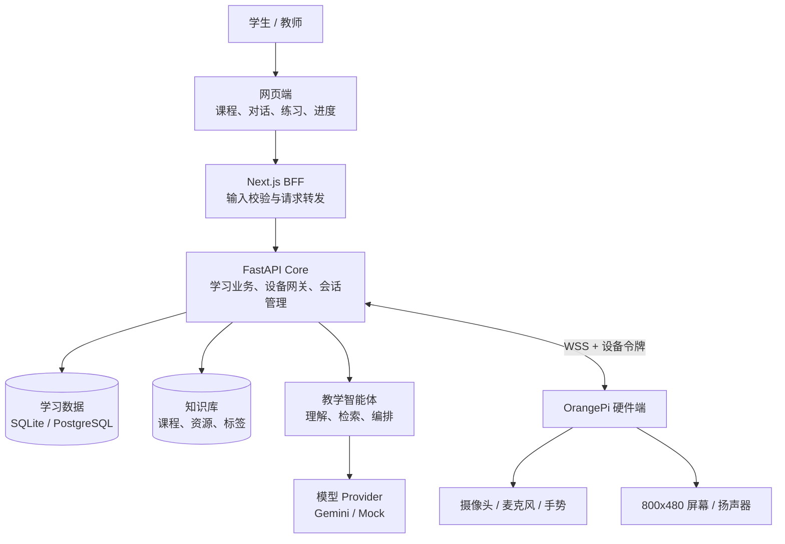
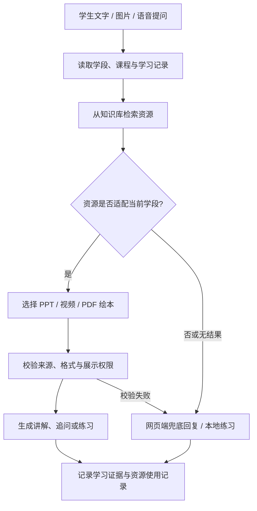
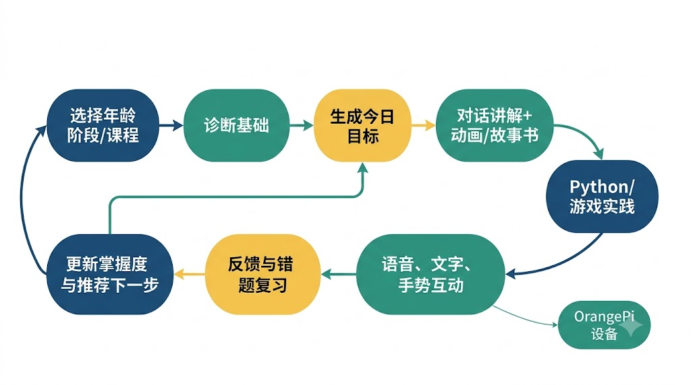
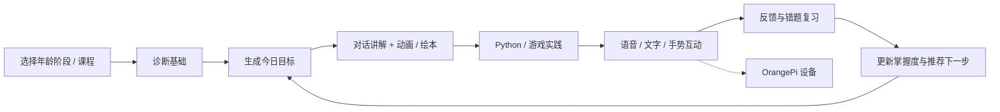
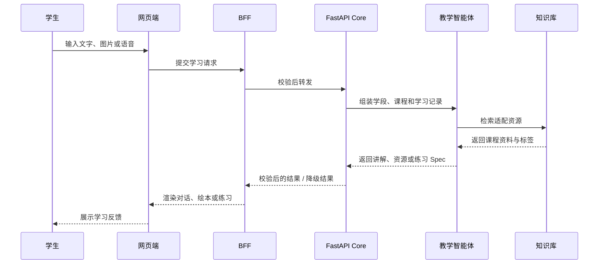
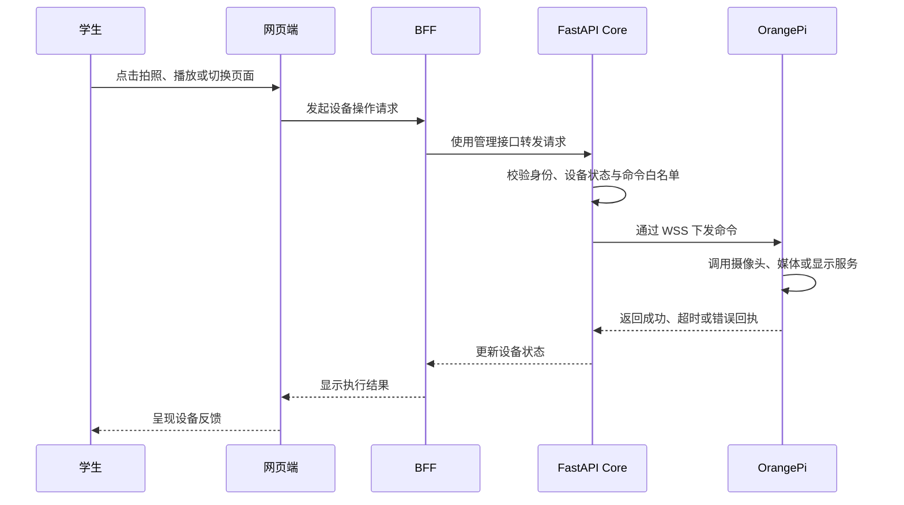
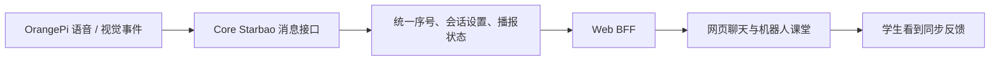
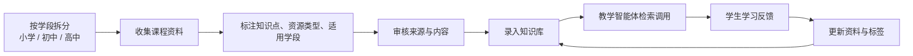

# 心星相伴项目设计简介

> 文档版本：v2.0
>
> 编写日期：2026-07-19
>
> 项目阶段：可演示原型，正在向可部署系统收敛

## 1. 项目基本信息

### 1.1 项目名称与定位

心星相伴是一个软硬件结合的 AI 智能辅助教学平台。简单来说，它把一个网页学习网站和一个放在桌面的 OrangePi 小终端连在一起：学生可以在网页上选年级、选课程、提问题、看绘本或视频，也可以通过硬件端用语音、手势和摄像头互动。

平台面向小学低阶段、小学高阶段、初中和高中等不同学习阶段的用户，帮助他们学习 AI 通识知识。学生不需要先懂很多技术，先选自己所在的学习阶段，再跟着系统提问、练习和复习即可；系统会把对话、答题和互动过程记录下来，逐步给出更合适的学习内容。


### 1.2 项目链接与运行入口

| 类型 | 地址/状态 | 说明 |
| --- | --- | --- |
| GitHub 仓库 | [github.com/MaomaoBuhuiJAVA/mambo-k12-ai-robot](https://github.com/MaomaoBuhuiJAVA/mambo-k12-ai-robot) | 项目源代码、协议、部署脚本和验证文档 |
| 本地网页 | `http://localhost:3000` | 运行 `npm run dev` 后访问 |
| 已上线网页 | [medical-device-ops-platform.asia/preview](https://medical-device-ops-platform.asia/preview) | 当前项目的线上访问入口 |
| 本地 Core API | `http://127.0.0.1:8000` | FastAPI 开发服务 |

### 1.3 项目成员


| 成员 | 负责模块 | 主要交付物 |
| --- | --- | --- |
| 陈思宏 | 硬件端与服务端 | OrangePi device-agent、摄像头/音频/手势链路、WSS 通信、FastAPI Core、数据库、设备命令与部署联调 |
| 陈孝健 | 教学智能体 | 负责可精准调用 PPT、视频和 PDF（绘本）资源的智能体；后续根据实际情况判断是否接入编程和游戏功能 |
| 谭湘君 | 汇报与总结 | 周进度汇报、项目总结 |
| 苏越 | PPT 与答辩展示 | 项目 PPT、架构/流程视觉整理、展示页面与答辩材料排版 |
| 知识库组 | K12 知识库建设 | 小学、初中、高中三个学段的课程资料整理、知识点拆分、题目/素材校验和课程入库 |

知识库组成员为：吴先宏、叶信宪、苏振育、盛宏涛。该组按小学、初中、高中三个学段协作建设知识库。

## 2. 项目目标与使用场景

### 2.1 目标

1. **按年龄阶段组织内容**：支持小学低年级、小学高年级、初中和高中四类阶段；阶段会影响表达方式、知识深度、提示强度和练习形式。
2. **形成学习闭环**：每次对话、答题、编程运行和设备互动都应转化为可记录的数据，并上传至数据库，为后续构建用户画像提供依据；即使暂未形成完整画像，也会保留相关学习数据。
3. **同时支持网页和机器人**：网页适合完整课程、编程和进度查看，OrangePi 适合桌面陪伴、语音、图像、手势和即时反馈。后续计划通过人脸与声纹（是否接入声纹以实际测试为准）辅助确认身份信息，并同步双端数据。
4. **保持模型可替换**：以教学智能体作为主要处理方式；当智能体无法回答问题或发生异常时，由网页端提供兜底回复。
5. **控制 AI 和硬件风险**：模型只能输出自然语言或经过 Schema 校验的 Spec，所有数据库写入、媒体生成、评分、渲染和设备命令都由确定性程序执行。

### 2.2 典型使用场景

- 学生选择“初中数学”后，系统会先判断是否已有用户学习数据；首次使用时可给出基础问题（可跳过），再生成今日目标和分步讲解。没有足够数据时，系统按默认学习路径进行。
- 学生可以文字提问、上传图片、录音，或在 OrangePi 前通过语音和手势互动。
- 智能体把知识点转化为解释、绘本、动画、练习题或 Python 实验；网页负责展示和运行。
- 学生完成练习后，系统记录正确率、错误类型、停留时间和掌握度，推荐复习或下一节课程。

### 2.3 实际使用方案

下面的流程既可以用于日常学习，也可以直接用于项目演示：

1. **先选阶段和课程。** 打开网页后，学生先选择小学、初中或高中，再选择本次想学的 AI 知识点；第一次使用时，可以先做几道基础问题，也可以直接跳过。
2. **边问边学。** 学生可以像平时聊天一样提问，也可以上传图片或录一段语音。网页会给出解释，并按需要展示绘本、PPT、视频或练习。
3. **用硬件端增加互动。** 在 OrangePi 旁边学习时，学生可以通过语音唤醒、手势移动光标，或让摄像头参与互动；硬件端不替代网页，而是让学习过程更有参与感。
4. **做题和看反馈。** 学完一个小知识点后，学生完成练习或编程小实验。系统会告诉学生哪里答对、哪里需要再看，并推荐下一步内容。
5. **老师或演示人员查看结果。** 需要展示项目时，可以打开学习记录、资源调用结果和设备状态，说明这个学生本次学了什么、用了哪些资源、下一步该怎么学。


## 3. 总体架构

### 3.1 演示流程：系统整体架构



图 1 展示网页端、服务端、智能体、知识库和硬件端之间的基本关系。网页负责学习交互，Core 负责业务状态和安全校验，智能体负责教学编排，OrangePi 负责本地输入输出。

### 3.2 关键边界

- **网页不是数据源**：当前原型的学习状态和对话仍有一部分保存在浏览器 `localStorage`；正式版需要把匿名浏览器状态迁移到 Core 的账户和学习档案。
- **Core 不是 Vercel Function**：FastAPI Core 需要常驻进程和 WebSocket，因此应部署在容器、虚拟机或可保持长连接的平台，不能把设备长连接塞进短生命周期的 Vercel Function。
- **智能体不能直连设备**：模型不获得 Shell、数据库或硬件权限；设备动作必须由 Core 根据白名单命令创建、校验、审计和回执。
- **设备不执行任意脚本**：OrangePi 只接受 `ping`、`get_status`、拍照、媒体播放、屏幕模式切换等明确命令。
- **视觉优先本地处理**：原始摄像头帧默认留在设备内存；手势和人脸功能优先传输归一化事件或特征，不把原始视频默认上传。

## 4. 三端与网页端分工

### 4.1 服务端：业务中台与安全边界

服务端位于 `server/`，核心是 FastAPI Core、SQLAlchemy/Alembic 和设备网关。它是所有跨端状态的权威入口，主要职责如下。

1. **身份、令牌和权限**：校验管理令牌、设备令牌和后续的学生/教师身份；正式版扩展 RBAC、家长监护和教师审核。
2. **学习业务**：管理学生档案、年龄阶段、课程、学习会话、消息、练习尝试、成绩、反馈和掌握度。
3. **AI 编排**：把课程目标、年龄阶段、历史学习证据和工具权限组装成 TeachingAgent 上下文，调用 Provider，并接收自然语言或结构化 Spec。
4. **Starbao 共享会话**：通过 `/api/v1/starbao` 保存网页与机器人之间的消息序号、会话设置和播报状态，避免两个入口各自维护孤立上下文。
5. **设备网关**：维护 OrangePi WSS 长连接、心跳、能力上报、在线状态、状态历史、命令白名单、命令回执和超时。
6. **媒体与文档任务**：对 DOCX、PPTX、绘本、动画参数和图片等任务进行 Schema、大小、来源和状态校验，再交给确定性渲染器。
7. **可观测性和降级**：记录请求 ID、耗时、模型/Provider、错误和设备回执；AI、Redis 或设备不可用时，返回明确的降级状态，不伪装成成功。

主要接口族包括：

```text
GET/POST/PATCH /api/v1/students
GET/POST        /api/v1/courses
GET/POST        /api/v1/learning-sessions
GET/POST        /api/v1/learning-sessions/{id}/messages
GET/POST        /api/v1/learning-sessions/{id}/attempts
GET/POST        /api/v1/devices/{device_id}/commands
GET             /api/v1/devices/{device_id}/status-history
GET             /api/v1/commands/{command_id}
POST            /api/v1/starbao/messages
POST            /api/v1/starbao/turn
```

### 4.2 硬件端：OrangePi 本地交互终端

硬件端位于 `device/` 和 `deploy/`，运行 `device-agent`、本地反向代理、浏览器启动脚本以及可选的手势/唤醒词服务。

1. **连接和身份**：通过 WSS 主动连接 Core，完成设备认证、`hello` 能力上报、心跳、自动重连和断线状态通知。
2. **输入输出管理**：访问 `/dev/video0` 摄像头、ALSA 麦克风、扬声器和 `:0` 显示器；支持拍照、播放媒体和 800x480 学习页面。
3. **本地视觉**：MediaPipe Tasks 负责手部关键点和手势状态；可选 OpenCV YuNet/SFace 负责低频人脸录入/识别。视觉过程只把手势、坐标、置信度或特征事件交给上层。
4. **命令执行**：只执行服务端下发的白名单动作，带参数校验、超时、回执和错误码，不接受任意 Python、Shell 或 JavaScript。
5. **桌面集成**：通过 systemd 保证代理、手势视觉和浏览器服务开机启动；本地 WebKitGTK 不可用时，可切换到 Chromium/本地代理方案。

### 4.3 智能体：教学理解与内容编排层

TeachingAgent 位于服务端业务编排层，不是独立数据库，也不是硬件控制器。

1. 根据年龄阶段、课程目标、知识点和历史证据理解学生问题。
2. 生成适合当前学生的解释、追问、提示、总结、错题反馈和下一步建议。
3. 通过受控工具生成绘本、教学材料、动画参数、练习题和学习推荐 Spec。
4. 参考课程来源和学习证据，保留可追溯的依据，避免把模型自由发挥当成课程事实。
5. 在学生答错、停留过久或完成阶段目标时，触发主动教学动作。
6. 通过 Provider 接口隔离模型供应商，当前可接 Gemini 和 Mock，并为后续模型保留替换点。

智能体的输出必须经过 Schema、长度、来源和权限检查。模型可以提出“生成一个绘本”或“给出一个设备动作意图”，但不能直接运行任意代码、写数据库、发起 Shell 或控制电机。

#### 演示流程：智能体资源调用与兜底



该流程保留“智能体优先、网页兜底”的设计：智能体负责理解问题和选择资源，网页端负责在资源缺失或调用异常时维持可继续学习的体验。

### 4.4 网页端：学习体验与 BFF

网页端位于 `apps/web/`，使用 Next.js App Router。它负责把复杂的服务能力组织为学生和教师可理解的学习界面：

- `/`：年龄阶段、课程、对话、图片提问、语音输入、材料、动画、绘本和游戏化练习入口。
- `/lab`：Monaco Editor + Pyodide Worker 的 Python 实验室，负责运行、停止、重置、stdout 和错误反馈。
- `/progress`：掌握度、练习证据、错题和间隔复习建议。
- `/robot`：800x480 机器人课堂页面，呈现语音、文字、状态和设备交互。
- `/workspace`：学习工作台；`/preview`：视觉预览和交互验收页。
- `app/api/*`：BFF 路由，隐藏管理令牌、转发 AI/材料/设备请求，并对前端输入做基本校验。

网页端在设备离线或模型不可用时仍能展示课程事实、种子绘本、本地练习和已保存进度；这类降级状态必须在界面上明确呈现。

## 5. 硬件清单

| 硬件/设备 | 用途 | 当前状态 |
| --- | --- | --- |
| OrangePi 开发板（文档中的设备 ID：`orangepi4pro-dev-01`） | 运行 device-agent、本地视觉、浏览器和媒体服务 | 已接入开发链路，现场部署仍需验收 |
| USB/板载摄像头（默认 `/dev/video0`） | 拍照、手势关键点、人脸录入/识别 | 摄像头显示链路已验证；完整实物手势闭环仍需现场验收 |
| 麦克风与 ALSA 音频输入 | 语音唤醒、录音、ASR 输入 | 接口已预留，实际音频质量依设备而定 |
| 扬声器/音频输出 | 播放 TTS、提示音和媒体 | 由本地媒体进程控制 |
| 800x480 显示器 | 展示机器人课堂和网页学习页面 | 页面尺寸与本地浏览器方案已适配 |
| 可选 NPU/硬件加速 | 运行设备侧视觉模型 | 仅作为可选能力，不是核心网页功能的必要依赖 |
| 网络连接 | OrangePi 与 Core 之间的 WSS，网页与 BFF 之间的 HTTPS | 生产环境必须使用 HTTPS/WSS |

## 6. 软件与依赖清单

### 6.1 网页与 BFF

| 类别 | 技术 |
| --- | --- |
| 运行时 | Node.js >= 20.9、Next.js 16.2.10、React 19.2.4 |
| 语言 | TypeScript 5、React Server/Client Components |
| AI 接入 | Vercel AI SDK 7、OpenAI-compatible Provider、Gemini 路由 |
| 交互组件 | Monaco Editor、Lucide React、Zod |
| 编程实验 | Pyodide Worker |
| 材料生成 | `docx`、`pptxgenjs` |
| 测试 | Vitest、Testing Library、Playwright |

### 6.2 Core 服务端

| 类别 | 技术 |
| --- | --- |
| 运行时 | Python 3.10+、Uvicorn |
| Web/API | FastAPI 0.139.2、Pydantic 2.13.4、WebSocket |
| 数据访问 | SQLAlchemy 2.0.51 async |
| 数据库 | SQLite + aiosqlite（开发/单机）；PostgreSQL + asyncpg（生产目标） |
| 迁移 | Alembic 1.18.5 |
| 缓存/限流 | Redis/Upstash（生产配置） |
| 交付 | Docker、systemd、OpenAPI |
| 测试 | pytest、httpx |

### 6.3 设备侧

| 类别 | 技术/组件 |
| --- | --- |
| 设备代理 | Python `device.agent`、WSS、心跳、命令回执 |
| 摄像头与视觉 | OpenCV、MediaPipe Tasks hand landmarks；可选 YuNet/SFace |
| 音频 | ALSA、浏览器 MediaRecorder、本地媒体播放 |
| 浏览器 | WebKitGTK 优先，Chromium/本地 Web 代理作为回退 |
| 守护进程 | systemd：device-agent、hand-vision、wakeword、local-web-proxy |
| 显示 | X11 `:0`、800x480 页面布局 |

### 6.4 面向生产的升级技术路线（规划）

下表是项目后续准备接入的生产化技术方案，用于支持更多学生、更丰富的课程资源和更稳定的设备管理。该表中的内容属于**升级规划**，不等同于当前已经全部上线的功能。

| 方向 | 升级方案 | 解决的问题 |
| --- | --- | --- |
| 知识库检索 | PostgreSQL + `pgvector`、关键词与向量混合检索、重排序 | 让智能体从适合当前学段的资料中找答案，而不是只靠模型临场生成 |
| 智能体编排 | TeachingAgent 状态机、工具调用、结构化输出与结果校验 | 把“提问 - 找资源 - 讲解 - 出练习 - 记录结果”拆成可检查的步骤 |
| 实时消息 | WSS、Redis Streams、事件幂等与消息序号 | 多台设备或多个页面同时使用时，减少重复消息和状态错乱 |
| 端侧视觉 | MediaPipe、OpenCV、ONNX Runtime / OrangePi NPU 加速 | 把手势、人脸等基础识别尽量放在设备侧，降低延迟并减少原始视频上传 |
| 可观测性 | OpenTelemetry、结构化日志、Prometheus / Grafana | 出现模型、设备或网络问题时，能知道问题在哪一段，而不是只看到“请求失败” |
| 部署交付 | Docker、GitHub Actions、Vercel、容器化 Core、Nginx 反向代理 | 让网页、服务端和设备端可以分别发布、回滚和维护 |
| 安全与权限 | JWT/RBAC、独立设备令牌、HTTPS/WSS、审计日志 | 区分学生、教师、管理员和设备权限，避免令牌和设备命令混用 |

### 6.5 技术方案的实际落地方式

项目不会一开始就把所有“大技术”一次性堆进去。现在先把网页、服务端、智能体和 OrangePi 的基本学习流程跑通；当课程资源变多、学生数量增加、设备需要长期在线时，再逐步接入向量检索、消息流、监控和更严格的权限管理。这样既能保证演示时好用，也不会让项目因为架构太复杂而难以维护。

## 7. 关键流程

### 7.1 学生学习闭环



图 3 由 Gemini 根据项目当前学习流程生成。准确的业务状态仍以 Core 学习会话、消息、练习尝试和进度接口为准。



### 7.2 AI 对话流程

1. 学生在网页或机器人端输入文字、图片或语音。
2. 网页端 BFF 校验大小、格式和请求来源，并转发到 Core/AI 路由。
3. Core 读取阶段、课程、历史会话和学习证据，创建 TeachingAgent 上下文。
4. Provider 调用 Gemini 或 Mock，返回流式文本或结构化教学 Spec。
5. Core 对返回值执行 Schema、长度、内容来源和工具权限校验。
6. 网页渲染回答、绘本、动画或练习；学习消息和证据写入当前存储边界。
7. 模型不可用时，系统返回课程事实、种子绘本或本地练习，并明确显示降级状态。



### 7.3 网页与 OrangePi 设备流程

1. OrangePi device-agent 通过设备令牌向 Core 建立 WSS，并上报能力、屏幕和音频状态。
2. 网页 BFF 只通过管理接口读取清洗后的设备状态，不直接接触设备 Socket。
3. 需要拍照、播放、屏幕切换等动作时，Core 生成白名单命令并保存命令 ID。
4. 设备执行命令后返回成功、超时或错误回执；Core 更新状态历史，网页刷新设备卡片。
5. 手势/人脸视觉在设备本地生成归一化事件，必要时通过 Starbao 会话写入网页可读的消息序列。



### 7.4 Starbao 共享会话流程



它解决的是“网页和机器人看到同一段学习上下文”的问题，不等同于正式账户系统。跨浏览器、跨设备同步仍需要后续的学生身份和服务端档案迁移。

### 7.5 知识库建设与教学资源流程



该流程用于指导知识库组的协作：每条资源至少应包含适用学段、知识点、资源类型、来源和审核状态，便于智能体按学习目标调用并持续优化。

## 8. 数据、安全与隐私

- 模型 API Key、管理令牌和设备令牌只能放在服务端环境变量，不能写入前端包、仓库或开发板示例以外的明文配置。
- 每台设备使用独立凭证；公网环境使用 HTTPS/WSS，命令带白名单、超时、回执和审计记录。
- 不允许远程 Shell；设备代理不执行服务端传入的任意 Python、Shell 或 JavaScript。
- 未成年人数据最小化保存。当前原型不要求真实姓名、精确生日和学校全称；生产版需要补充删除、导出、家长监护和内容审核策略。
- 原始摄像头帧默认只在设备内存中处理；人脸识别优先保存特征向量而不是照片，并限制采集频率和用途。
- AI 输出和设备命令分离。模型负责“理解和建议”，确定性程序负责“验证、评分、渲染、写库和执行”。
- 生产环境需要补充 Core 公网 HTTPS/WSS、PostgreSQL 备份、监控、密钥轮换、速率限制和故障告警。

## 9. 当前实现、验证与边界

### 9.1 已实现或已验证

- 四个学习阶段、课程入口、文本对话、图片提问、浏览器录音和本地语音朗读。
- 教学材料 DOCX/PPTX、动画讲解、结构化绘本、Python 实验室、游戏化练习和进度推荐。
- FastAPI Core 的学习数据模型、设备状态/命令接口、WSS 协议、Starbao 共享会话接口和 PostgreSQL URL 兼容处理。
- OrangePi 800x480 页面、本地代理、摄像头显示和 XTest 光标控制链路；真实拳头点击和完整音频现场验收仍需在开发板上完成。
- 当前工作树验证结果：Web `71` 个测试文件、`438` 项测试通过；TypeScript typecheck 通过；Next.js production build 通过；项目 `.venv` 中 Python 测试通过，`1` 项按环境跳过。

建议复核命令：

```powershell
npm.cmd test --workspace apps/web -- --run
npm.cmd run typecheck --workspace apps/web
npm.cmd run build --workspace apps/web
.venv\Scripts\python.exe -m pytest -q
git diff --check
```

### 9.2 明确未完成事项

1. 学生登录、教师后台、家长监护、RBAC 和正式内容审核。
2. 官方教材导入、文档解析、向量混合检索和教师审核流。
3. 浏览器 `localStorage` 状态向 Core 匿名档案/正式账户的迁移，以及跨浏览器、跨设备同步。
4. 网页与机器人共享同一学习会话的完整投屏、ASR/TTS 接力和视觉事件回写。
5. Core 公网 HTTPS/WSS、生产 PostgreSQL、备份、监控、Production 域名和现场设备安装验收。
6. 自定义视觉模型的 ONNX/量化精度基线，以及在目标 OrangePi 上的长期稳定性测试。

## 10. 发布与后续计划

### 10.1 发布前检查

- 定期验证已上线网页的可访问性；如调整路由、域名或托管平台，同步更新本文“已上线网页”和“正式 Production 网页”两行。
- 将 Core 部署到支持常驻进程和 WSS 的平台，配置 HTTPS、PostgreSQL、Redis、备份和监控。
- 为每台 OrangePi 生成独立设备令牌，写入 systemd 环境文件，不把令牌提交到 Git。
- 在 800x480 目标屏幕完成网页、触摸/鼠标、语音、摄像头、手势和离线降级的现场验收。
- 用真实课程资料完成一次“选课 → 诊断 → 对话 → 实践 → 反馈 → 推荐”的端到端演示，并保存日志和截图证据。

### 10.2 迭代顺序

1. 先完成已上线网页的持续可用性检查、Core 公网 HTTPS/WSS、PostgreSQL/备份和设备现场验收。
2. 再做匿名状态迁移、学生/教师身份和跨设备学习档案。
3. 在数据边界稳定后接入教材 RAG、教师审核和更严格的内容安全策略。
4. 最后优化视觉模型、主动教学、语音接力和多设备管理，避免在基础设施未稳定前堆叠模型能力。

## 11. 参考资料

- [项目 README](../../README.md)
- [产品与技术设计](../product-technical-design.md)
- [功能交接说明](../handoff/functional-handoff.md)
- [设备通信协议](../protocol.md)
- [当前验证证据索引](../evidence/index.md)

文中的两张 JPG 架构图和流程图由 Gemini 依据项目当前模块、接口和硬件边界生成于 2026-07-19；图像用于直观说明，文字、Mermaid 和仓库代码才是项目事实的权威来源。
